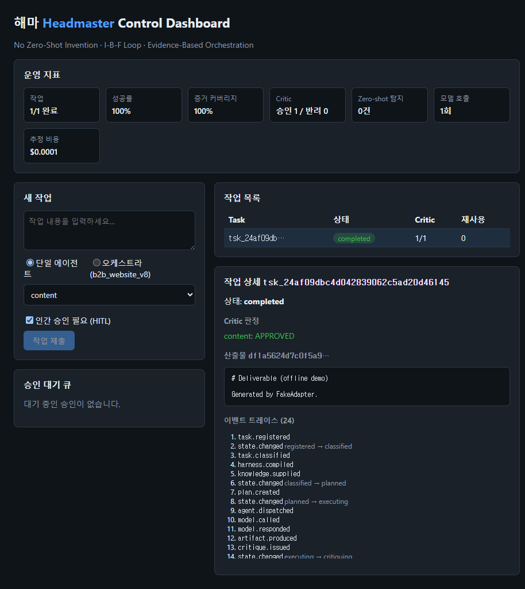

# 해마 (Headmaster)

[](https://github.com/lovicho/headmaster/actions/workflows/ci.yml)

Headmaster는 사용자가 자연어로 작업을 주면 적절한 에이전트 하네스를 선택하고, 실행, 검증, 승인, 산출물 발행, 기억 순환까지 관리하는 LLM-agnostic 오케스트레이션 컨트롤 플레인입니다.

해마는 하나의 에이전트가 아닙니다. 여러 에이전트가 안정적으로 일하도록 작업을 표준화하고, 모델 호출을 추상화하고, 산출물의 근거를 검증하고, 승인과 복구 경계를 관리하는 제어 계층입니다.



## 목차

- [한눈에 보기](#한눈에-보기)
- [왜 Headmaster인가](#왜-headmaster인가)
- [현재 구현 범위](#현재-구현-범위)
- [핵심 원칙](#핵심-원칙)
- [아키텍처](#아키텍처)
- [작업 생명주기](#작업-생명주기)
- [저장소 구조](#저장소-구조)
- [요구사항](#요구사항)
- [빠른 시작](#빠른-시작)
- [CLI 사용법](#cli-사용법)
- [모델 provider](#모델-provider)
- [Claude Code / Codex / Antigravity에서 해마 호출](#claude-code--codex--antigravity에서-해마-호출)
- [대시보드와 API](#대시보드와-api)
- [하네스와 오케스트라](#하네스와-오케스트라)
- [I-B-F Proof와 Critic](#i-b-f-proof와-critic)
- [메모리와 지식 순환](#메모리와-지식-순환)
- [승인, 복구, 안전 경계](#승인-복구-안전-경계)
- [검증과 CI](#검증과-ci)
- [설정 파일](#설정-파일)
- [문제 해결](#문제-해결)
- [개발 가이드](#개발-가이드)
- [로드맵](#로드맵)
- [라이선스](#라이선스)

## 한눈에 보기

Headmaster가 하는 일은 다음과 같습니다.

| 영역 | 설명 |
| --- | --- |
| 작업 표준화 | 사용자의 자연어 요청을 `TaskSpec`으로 컴파일합니다. |
| 하네스 선택 | 작업 성격에 맞는 단일 에이전트 하네스 또는 다단계 오케스트라를 사용합니다. |
| 모델 추상화 | 하네스는 cost tier만 선언하고 실제 provider/model은 설정에서 바꿉니다. |
| 증거 검증 | 산출물은 I-B-F Proof와 EvidenceBundle을 포함해야 하며 Critic이 검증합니다. |
| 승인 게이트 | 고위험 작업이나 최종 발행에는 승인 흐름을 둘 수 있습니다. |
| 이벤트 소싱 | 모든 상태 변화와 모델/도구/승인 이벤트를 SQLite 이벤트 로그에 기록합니다. |
| 복구 | 서버 재시작 후에도 이벤트 로그를 replay하여 작업 상태와 산출물을 조회합니다. |
| 지식 순환 | 승인된 결과와 경험을 Memory Fabric에 축적하고 다음 작업의 RAG 자산으로 재사용합니다. |
| CLI/대시보드 | 로컬 CLI와 FastAPI/React 대시보드를 모두 제공합니다. |
| Agent CLI 연동 | Claude Code, Codex CLI, Antigravity CLI에서 자연어 또는 `/haema`로 호출할 수 있습니다. |

가장 짧은 오프라인 실행 예시는 다음과 같습니다.

```powershell
cd backend
uv venv --python 3.12
uv pip install -e ".[dev]"
uv run headmaster run "B2B 랜딩 카피 초안" --provider fake
```

## 왜 Headmaster인가

일반적인 단일 에이전트 실행은 빠르게 시작할 수 있지만, 작업이 커질수록 다음 문제가 생깁니다.

- 모델이 근거 없이 산출물을 만들어도 나중에 추적하기 어렵습니다.
- 어떤 에이전트가 어떤 역할을 맡았는지, 어떤 기준으로 통과했는지 흐려집니다.
- 모델 provider를 바꾸면 프롬프트, 비용, 품질 기준이 함께 흔들립니다.
- 승인, 실패, 재시작, 재검증 흐름이 임시 스크립트에 흩어집니다.
- 좋은 산출물을 다음 작업의 자산으로 다시 쓰는 과정이 수동으로 남습니다.

Headmaster는 이 문제를 “모델 호출”이 아니라 “작업 운영” 문제로 봅니다. 그래서 모델 자체보다 다음 경계를 먼저 고정합니다.

- 입력은 `TaskSpec`으로 정규화합니다.
- 역할은 하네스 manifest로 선언합니다.
- 산출물은 evidence와 artifact로 구조화합니다.
- 상태 변화는 이벤트 로그로 남깁니다.
- 검증과 승인은 명시적인 상태로 분리합니다.
- 모델 provider는 교체 가능한 adapter로 격리합니다.

## 현재 구현 범위

현재 저장소는 PoC를 넘어 로컬 운영이 가능한 형태의 컨트롤 플레인을 포함합니다.

| 단계 | 상태 | 포함된 내용 |
| --- | --- | --- |
| Phase 0-1 | 구현됨 | 스키마, 상태 머신, 하네스 템플릿, ModelGateway, replay, Critic, CLI |
| Phase 2 | 구현됨 | Memory Fabric, KnowledgeManager, 지식 순환, 격리/승격 |
| Phase 3 | 구현됨 | HITL 승인, 예산 관리, fan-out 오케스트라, golden eval, audit |
| Phase 4 | 구현됨 | FastAPI 제어 API, 재시작 복구, React 대시보드, self-improvement, OAuth CLI provider |
| 다음 후보 | 예정 | rejection taxonomy, MCP transport, A2A, PostgreSQL/Temporal 검토 |

현재 기본 저장소는 로컬 SQLite 기반입니다. 장기 운영이나 다중 사용자 배포를 위해서는 PostgreSQL, durable workflow runtime, 권한 모델, 장기 artifact storage를 추가하는 것이 다음 단계입니다.

## 핵심 원칙

| 원칙 | 구현 방식 |
| --- | --- |
| No Zero-Shot Invention | 모든 산출물은 I-B-F Proof를 포함해야 하며, Critic이 증거 존재와 참조 무결성을 검증합니다. |
| I-B-F Loop | Imitate, Benchmark, Fusion, Maintain 흐름으로 내부 자산과 외부 기준을 결합합니다. |
| English-Core / Korean-Edge | 내부 스키마와 판단 로직은 영어 중심으로 유지하고, 사용자-facing 산출물은 한국어로 제공합니다. |
| LLM-agnostic | 하네스는 cost tier만 선언하고 실제 provider/model은 `backend/headmaster/config/models.yaml`에서 결정합니다. |
| Event-sourced state | 작업 상태와 감사 추적은 이벤트 로그에서 replay할 수 있도록 기록합니다. |
| Safety-by-default | 승인 게이트가 없으면 고위험 작업은 기본적으로 보수적으로 처리하고, 검증 실패 산출물은 격리합니다. |
| Recoverable operations | 재시작 이후에도 완료 작업, 산출물, 승인 ticket, audit trace를 다시 조회할 수 있게 설계합니다. |

## 아키텍처

```text
Control Plane
  Task Compiler
  Harness Registry
  Harness Compiler
  Topology Selector
  Policy Engine
  Budget Ledger

Execution Plane
  Orchestrator
  Agent Runtime
  ModelGateway
  ToolGateway
  Memory Fabric
  KnowledgeManager

Assurance Plane
  Critic Service
  Approval Gateway
  Eval Runner
  Metrics
  Audit Trail
  Self-Improvement

Interfaces
  Python CLI
  FastAPI Control API
  React Dashboard
  Claude Code / Codex / Antigravity invocation files
```

### Control Plane

Control Plane은 사용자의 요청을 실행 가능한 단위로 바꾸는 계층입니다.

- `Task Compiler`: 자연어 요청을 `TaskSpec`으로 변환합니다.
- `Harness Registry`: `backend/headmaster/templates/harnesses` 아래의 하네스 manifest를 로드합니다.
- `Topology Selector`: 단일 에이전트, fan-out, 오케스트라 같은 실행 형태를 결정합니다.
- `Policy Engine`: 도구 사용과 외부 쓰기 같은 위험한 행위를 제한합니다.
- `Budget Ledger`: token/cost 예산을 cost tier와 연결하고 soft/hard limit를 계산합니다.

### Execution Plane

Execution Plane은 실제 작업을 진행합니다.

- `Orchestrator`: 상태 전환, 모델 호출, Critic 검증, 재계획, 발행, 지식 순환을 조율합니다.
- `AgentRuntime`: 하네스 지시문과 작업 입력을 모델 provider에 전달합니다.
- `ModelGateway`: provider/model routing을 담당합니다.
- `ToolGateway`: 허용된 도구만 실행되도록 통제합니다.
- `Memory Fabric`: 승인된 자산과 요약을 SQLite에 저장하고 검색합니다.
- `KnowledgeManager`: 작업 결과를 다음 작업에서 재사용 가능한 지식으로 승격합니다.

### Assurance Plane

Assurance Plane은 산출물 품질과 운영 안정성을 확인합니다.

- `CriticService`: EvidenceBundle, I-B-F Proof, zero-shot 여부를 검증합니다.
- `ApprovalGateway`: 콘솔 승인, 정적 승인, API queue 승인을 제공합니다.
- `Evaluator`: golden set 회귀 테스트를 실행합니다.
- `Metrics`: 이벤트 로그에서 완료율, 실패율, 비용 등을 계산합니다.
- `Audit`: 상태 변화와 주요 판단을 trace 가능한 이벤트로 남깁니다.
- `Self-Improvement`: 반복 실패 패턴을 분석하고 하네스 개선안을 제안합니다.

## 작업 생명주기

Headmaster 작업은 명시적인 상태 머신을 따릅니다.

```text
registered
  -> classified
  -> planned
  -> executing
  -> critiquing
  -> validated
  -> publishing
  -> assimilating
  -> completed
```

상황에 따라 다음 상태도 사용됩니다.

| 상태 | 의미 |
| --- | --- |
| `awaiting_tool` | 도구 호출 결과를 기다립니다. |
| `awaiting_human_approval` | 사람 승인 또는 API 승인 ticket을 기다립니다. |
| `replanning` | Critic 반려 또는 gate 판단 후 재계획합니다. |
| `recovering` | 이벤트 로그를 바탕으로 복구 흐름에 들어갑니다. |
| `failed` | 정책 거절, 승인 거절, 검증 실패, 예외로 종료되었습니다. |

이벤트 로그에는 다음과 같은 event type이 기록됩니다.

- `task.registered`
- `task.classified`
- `harness.compiled`
- `plan.created`
- `agent.dispatched`
- `model.called`
- `model.responded`
- `tool.called`
- `tool.responded`
- `artifact.produced`
- `critique.issued`
- `approval.requested`
- `approval.granted`
- `approval.denied`
- `replan.triggered`
- `budget.exceeded`
- `state.changed`
- `artifact.published`
- `knowledge.supplied`
- `knowledge.assimilated`
- `policy.denied`
- `recovery.started`
- `task.completed`
- `task.failed`

Replay는 모델을 다시 호출하지 않습니다. 이미 기록된 이벤트만 읽어서 상태를 복원하므로, non-deterministic 모델 응답이 있어도 복구 결과는 이벤트 로그 기준으로 결정됩니다.

## 저장소 구조

```text
.
├─ README.md
├─ AGENTS.md
├─ CLAUDE.md
├─ dashboard-e2e-approved.png
├─ .github/workflows/ci.yml
├─ .claude/
│  ├─ commands/haema.md
│  └─ skills/haema/SKILL.md
├─ .agents/
│  └─ skills/haema/SKILL.md
├─ .agent/
│  └─ skills/haema/SKILL.md
├─ backend/
│  ├─ pyproject.toml
│  ├─ uv.lock
│  └─ headmaster/
│     ├─ api/
│     ├─ assurance_plane/
│     ├─ config/
│     ├─ control_plane/
│     ├─ execution_plane/
│     ├─ schemas/
│     ├─ storage/
│     ├─ templates/
│     └─ tests/
├─ frontend/
│  ├─ package.json
│  ├─ src/
│  └─ scripts/
├─ docs/
│  ├─ cli-agent-integrations.md
│  └─ recovery-runbook.md
├─ plan/
│  ├─ 01_해마_구현계획.md
│  ├─ 02_스키마_명세.md
│  └─ 03_검증기준.md
└─ 소스자료/
   ├─ 리서치/
   └─ 테스트설계/
```

중요한 파일은 다음과 같습니다.

| 파일 | 설명 |
| --- | --- |
| `backend/headmaster/cli.py` | CLI entrypoint입니다. |
| `backend/headmaster/api/main.py` | FastAPI control API입니다. |
| `backend/headmaster/integrations.py` | Claude/Codex/AGY 호출 파일 생성기입니다. |
| `backend/headmaster/config/models.yaml` | cost tier별 provider/model routing과 pricing 설정입니다. |
| `backend/headmaster/config/settings.yaml` | 기본 운영 설정입니다. |
| `backend/headmaster/templates/harnesses/*.yaml` | 단일 에이전트 하네스 manifest입니다. |
| `backend/headmaster/templates/harnesses/orchestra/*.yaml` | 다단계 오케스트라 manifest입니다. |
| `frontend/src/App.tsx` | React 대시보드의 최상위 컴포넌트입니다. |
| `docs/recovery-runbook.md` | 재시작/복구 경계를 설명합니다. |
| `docs/cli-agent-integrations.md` | Claude Code, Codex, AGY 호출 방법을 설명합니다. |

## 요구사항

### 백엔드

- Python 3.12 이상
- `uv`
- Windows에서 AGY PTY probe를 사용할 경우 `pywinpty`가 자동 의존성으로 설치됩니다.

### 프론트엔드

- Node.js 24
- npm

### 실제 모델 provider 사용 시

사용하려는 provider에 따라 다음 중 하나가 필요합니다.

- `ANTHROPIC_API_KEY`
- `OPENAI_API_KEY`
- Claude Code CLI 로그인 세션
- Codex CLI ChatGPT 로그인 세션
- Antigravity CLI 로그인 세션
- Gemini CLI 로그인 세션

오프라인 데모와 테스트는 `--provider fake`로 실행할 수 있습니다.

## 빠른 시작

### 1. 저장소 준비

```powershell
git clone https://github.com/lovicho/headmaster.git
cd headmaster
```

이미 이 작업 디렉터리에 있다면 다음처럼 이동합니다.

```powershell
cd C:\Users\lovic\Documents\Codex\2026-06-12\lovicho-headmaster-https-github-com-lovicho\work\headmaster
```

### 2. 백엔드 설치

```powershell
cd backend
uv venv --python 3.12
uv pip install -e ".[dev]"
```

### 3. 오프라인 단일 작업 실행

```powershell
uv run headmaster run "B2B 랜딩 카피 초안" --provider fake
```

성공하면 다음과 유사한 정보가 출력됩니다.

```text
task_id=tsk_...
topology=...
final_state=completed
supplied_assets=...
artifact_id=art_...
content_hash=...
artifact_path=data/artifacts/tsk_....md
```

### 4. 오프라인 오케스트라 실행

```powershell
uv run headmaster run "B2B 웹사이트 구축" --orchestra b2b_website_v8 --provider fake --approval grant
```

`b2b_website_v8`은 9개 역할과 여러 phase gate를 가진 엔터프라이즈 웹 구축 오케스트라입니다.

### 5. 결과 replay

```powershell
uv run headmaster replay <task_id>
```

### 6. 지표 확인

```powershell
uv run headmaster metrics
```

### 7. 회귀 평가 실행

```powershell
uv run headmaster eval
```

## CLI 사용법

CLI entrypoint는 `headmaster`입니다. 개발 환경에서는 `uv run headmaster ...` 형태로 실행합니다.

### `run`

작업을 실행합니다.

```powershell
uv run headmaster run "<작업 설명>" [옵션]
```

주요 옵션:

| 옵션 | 기본값 | 설명 |
| --- | --- | --- |
| `--harness` | `content` | 단일 에이전트 하네스 ID입니다. |
| `--orchestra` | 없음 | 오케스트라 하네스 ID입니다. 지정하면 `--harness` 대신 사용합니다. |
| `--provider` | 설정 파일 기본값 | 모델 provider를 강제로 지정합니다. |
| `--approval` | `prompt` | 승인 방식입니다. `prompt`, `grant`, `deny`를 지원합니다. |
| `--store` | `./data/events.sqlite3` | 이벤트 로그 SQLite 파일입니다. |
| `--memory-store` | `./data/memory.sqlite3` | Memory Fabric SQLite 파일입니다. |
| `--artifact-dir` | `./data/artifacts` | 발행 산출물 디렉터리입니다. |
| `--max-revisions` | `2` | Critic 반려 후 재시도 횟수입니다. |

예시:

```powershell
uv run headmaster run "제품 소개 페이지 카피 작성" --harness content --provider fake
uv run headmaster run "보안 점검 계획 작성" --harness secops_qa --provider fake
uv run headmaster run "B2B 웹사이트 구축" --orchestra b2b_website_v8 --provider fake --approval grant
```

### `serve`

FastAPI control API와 정적 대시보드를 실행합니다.

```powershell
uv run headmaster serve --provider fake
```

주요 옵션:

| 옵션 | 기본값 | 설명 |
| --- | --- | --- |
| `--host` | `127.0.0.1` | API bind host입니다. |
| `--port` | `8400` | API port입니다. |
| `--provider` | 설정 파일 기본값 | API에서 사용할 provider override입니다. |
| `--store` | `./data/events.sqlite3` | 이벤트 로그 파일입니다. |
| `--memory-store` | `./data/memory.sqlite3` | 메모리 저장소 파일입니다. |
| `--artifact-dir` | `./data/artifacts` | artifact 저장 경로입니다. |
| `--static-dir` | `../frontend/dist` | 빌드된 대시보드 정적 파일 경로입니다. |

### `replay`

특정 작업의 상태 전이를 이벤트 로그에서 replay합니다.

```powershell
uv run headmaster replay <task_id>
```

저장소 파일을 바꿔 확인하려면 다음처럼 실행합니다.

```powershell
uv run headmaster replay <task_id> --store .\data\events.sqlite3
```

### `metrics`

이벤트 로그에서 운영 지표를 계산합니다.

```powershell
uv run headmaster metrics
```

### `eval`

golden set 회귀 테스트를 실행합니다.

```powershell
uv run headmaster eval
```

다른 golden 파일을 쓰려면:

```powershell
uv run headmaster eval --golden path\to\critic_golden.json
```

### `improve`

실패 이벤트를 분석해 하네스 개선안을 제안합니다.

```powershell
uv run headmaster improve
```

검증을 통과한 patch를 실제 하네스 템플릿에 반영하려면:

```powershell
uv run headmaster improve --apply
```

### `integrations`

Claude Code, Codex CLI, Antigravity CLI에서 Headmaster를 호출할 수 있는 skill/command 파일을 설치합니다.

프로젝트 스코프:

```powershell
uv run headmaster integrations --scope project --root .. --tools all --force
```

사용자 전역 스코프:

```powershell
uv run headmaster integrations --scope user --tools all
```

특정 도구만 설치:

```powershell
uv run headmaster integrations --scope user --tools claude,codex
```

## 모델 provider

모델 provider는 두 종류로 나뉩니다.

1. API key 기반 provider
2. 로컬 OAuth CLI 세션 기반 provider

| Provider | 인증 방식 | 준비 명령/환경변수 | 설명 |
| --- | --- | --- | --- |
| `fake` | 없음 | 없음 | 테스트와 오프라인 데모용 provider입니다. |
| `anthropic` | API key | `ANTHROPIC_API_KEY` | 기본 routing provider입니다. |
| `openai` | API key | `OPENAI_API_KEY` | OpenAI API provider입니다. |
| `claude` | Claude Code OAuth | `claude auth login` | 로컬 Claude Code CLI 세션을 재사용합니다. |
| `codex` | Codex ChatGPT OAuth | `codex login` | 로컬 Codex CLI 로그인 세션을 재사용합니다. |
| `agy` | Antigravity CLI OAuth | `agy` 또는 AGY 로그인 흐름 | 로컬 Antigravity CLI 세션을 재사용합니다. |
| `gemini` | Gemini CLI OAuth | Gemini CLI 로그인 흐름 | 로컬 Gemini CLI 세션을 재사용합니다. |

Provider override 예시:

```powershell
uv run headmaster run "시장 조사 요약" --provider claude
uv run headmaster run "기능 구현 계획" --provider codex
uv run headmaster run "랜딩 페이지 초안" --provider agy
uv run headmaster run "오프라인 데모" --provider fake
```

Routing 기본값은 `backend/headmaster/config/models.yaml`에 있습니다.

```yaml
default_provider: anthropic
tiers:
  mini:
    provider: anthropic
  standard:
    provider: anthropic
  heavy:
    provider: anthropic
```

하네스는 `cost_tier`만 선언합니다. 어떤 모델을 실제로 쓸지는 `models.yaml`에서 바꾸므로 하네스 설계와 provider 선택이 분리됩니다.

## Claude Code / Codex / Antigravity에서 해마 호출

이 저장소는 세 가지 agent CLI에서 Headmaster를 호출할 수 있도록 프로젝트 스코프 파일을 포함합니다.

| 도구 | 자연어 안내 파일 | Slash/Skill 파일 |
| --- | --- | --- |
| Claude Code | `CLAUDE.md` | `.claude/skills/haema/SKILL.md`, `.claude/commands/haema.md` |
| Codex CLI | `AGENTS.md` | `.agents/skills/haema/SKILL.md` |
| Antigravity CLI | `AGENTS.md` | `.agent/skills/haema/SKILL.md` |

### 자연어 호출

각 CLI를 저장소 루트에서 연 뒤 다음처럼 말할 수 있습니다.

```text
해마로 "시장 조사 요약" 실행해줘
headmaster로 "B2B 랜딩 페이지 기획" 진행해줘
haema를 사용해서 "테스트 전략 작성" 해줘
```

### Slash-style 호출

```text
/haema 시장 조사 요약 --provider fake
/haema 기능 구현 계획 --provider codex
/haema 랜딩 페이지 초안 --provider agy
```

### 전역 설치

현재 사용자 계정의 agent CLI 설정에도 설치할 수 있습니다.

```powershell
cd backend
uv run headmaster integrations --scope user --tools all
```

전역 설치 시 생성되는 파일:

| 경로 | 용도 |
| --- | --- |
| `~/.claude/skills/haema/SKILL.md` | Claude Code skill |
| `~/.claude/commands/haema.md` | Claude Code legacy command fallback |
| `~/.agents/skills/haema/SKILL.md` | Codex Agent Skills workflow |
| `~/.codex/prompts/haema.md` | Codex custom prompt fallback |
| `~/.agent/skills/haema/SKILL.md` | Antigravity workspace-style skill |
| `~/.gemini/antigravity/skills/haema/SKILL.md` | Antigravity global skill fallback |

Codex custom prompt는 호환성 fallback입니다. 반복 가능한 workflow에는 skill을 우선 사용합니다.

자세한 내용은 [docs/cli-agent-integrations.md](docs/cli-agent-integrations.md)를 참고하세요.

## 대시보드와 API

### 프론트엔드 빌드

```powershell
cd frontend
npm ci
npm run build
```

### API와 대시보드 실행

```powershell
cd ../backend
uv run headmaster serve --provider fake
```

기본 주소:

```text
http://127.0.0.1:8400
```

`frontend/dist`가 있으면 FastAPI가 정적 대시보드를 함께 서빙합니다. 개발 중 Vite dev server를 따로 쓰려면:

```powershell
cd frontend
npm run dev
```

### API 엔드포인트

| Method | Path | 설명 |
| --- | --- | --- |
| `POST` | `/v1/tasks` | 작업을 제출합니다. |
| `GET` | `/v1/tasks` | 알려진 작업 목록을 조회합니다. |
| `GET` | `/v1/tasks/{task_id}` | 작업 상태를 조회합니다. |
| `GET` | `/v1/tasks/{task_id}/events` | 작업 이벤트 전체 trace를 조회합니다. |
| `GET` | `/v1/tasks/{task_id}/artifact` | 발행된 artifact 내용을 조회합니다. |
| `GET` | `/v1/approvals` | 대기 중인 승인 ticket을 조회합니다. |
| `POST` | `/v1/approvals/{ticket_id}` | 승인 ticket을 grant/deny합니다. |
| `GET` | `/v1/metrics` | 운영 지표를 조회합니다. |
| `POST` | `/v1/evals/run` | golden set 회귀 평가를 실행합니다. |

### API 예시

작업 제출:

```powershell
$body = @{
  text = "B2B 랜딩 카피 초안"
  harness = "content"
} | ConvertTo-Json

Invoke-RestMethod `
  -Method Post `
  -Uri http://127.0.0.1:8400/v1/tasks `
  -ContentType "application/json" `
  -Body $body
```

오케스트라 작업 제출:

```powershell
$body = @{
  text = "B2B 웹사이트 구축"
  orchestra = "b2b_website_v8"
  needs_human_approval = $false
} | ConvertTo-Json

Invoke-RestMethod `
  -Method Post `
  -Uri http://127.0.0.1:8400/v1/tasks `
  -ContentType "application/json" `
  -Body $body
```

작업 상태 조회:

```powershell
Invoke-RestMethod http://127.0.0.1:8400/v1/tasks/<task_id>
```

이벤트 trace 조회:

```powershell
Invoke-RestMethod http://127.0.0.1:8400/v1/tasks/<task_id>/events
```

승인 ticket 처리:

```powershell
$decision = @{
  granted = $true
  approver = "operator"
  note = "approved from API"
} | ConvertTo-Json

Invoke-RestMethod `
  -Method Post `
  -Uri http://127.0.0.1:8400/v1/approvals/<ticket_id> `
  -ContentType "application/json" `
  -Body $decision
```

## 하네스와 오케스트라

하네스는 에이전트 역할, 지시문, I-B-F protocol, output contract, language policy, tool policy, cost tier를 선언하는 YAML manifest입니다.

현재 단일 에이전트 하네스:

| Harness | 역할 |
| --- | --- |
| `content` | SEO/AEO copywriter 및 schema architect |
| `consultant` | 전략/제안/비즈니스 컨설팅 |
| `critic` | 증거 검증과 품질 판정 |
| `design` | 디자인 시스템과 UI 방향 |
| `dev_fe_be` | 프론트엔드/백엔드 구현 |
| `knowledge_manager` | 지식 검색, 저장, 유지보수 |
| `planner` | 정보구조, 실행계획, phase planning |
| `researcher` | 조사, benchmark, 근거 수집 |
| `secops_qa` | 보안, QA, 운영 안정성 |

현재 오케스트라:

| Orchestra | 설명 |
| --- | --- |
| `b2b_website_v8` | B2B 웹사이트 구축을 위한 7단계, 9역할 오케스트라 |

`b2b_website_v8`의 주요 phase:

| Phase | 제목 | 주요 에이전트 |
| --- | --- | --- |
| `phase_0` | Retrieve Knowledge & Hyper-Gap Benchmark | `knowledge_manager`, `researcher`, `consultant` |
| `phase_1` | I-B-F Fusion Execution — Planning | `planner` |
| `phase_2` | I-B-F Fusion Execution — Content | `content` |
| `phase_3` | I-B-F Fusion Execution — Design | `design` |
| `phase_4` | I-B-F Fusion Execution — Development | `dev_fe_be` |
| `phase_5` | Compliance & Final Deployment | `secops_qa` |
| `phase_7` | Permanent Capitalization of Outputs & Experiences | `knowledge_manager` |

새 하네스를 추가하려면:

1. `backend/headmaster/templates/harnesses/<id>.yaml`을 추가합니다.
2. `kind: agent`와 `harness_id`를 지정합니다.
3. `persona`, `inherited_directives`, `ibf_protocol`, `output_contract`, `tool_policy`, `cost_tier`를 채웁니다.
4. `uv run pytest headmaster/tests/test_harness_templates.py`를 실행합니다.
5. 필요한 경우 golden set을 업데이트합니다.

새 오케스트라를 추가하려면:

1. `backend/headmaster/templates/harnesses/orchestra/<id>.yaml`을 추가합니다.
2. `kind: orchestra`와 `required_roles`, `phases`, `approval_gates`를 선언합니다.
3. 각 phase에 agent list와 gate를 정의합니다.
4. `uv run headmaster run "<작업>" --orchestra <id> --provider fake --approval grant`로 smoke test를 합니다.

## I-B-F Proof와 Critic

Headmaster의 품질 기준은 “좋아 보이는 답변”이 아니라 “검증 가능한 산출물”입니다.

I-B-F는 다음 흐름입니다.

| 단계 | 의미 |
| --- | --- |
| Imitate | 내부에서 승인된 자산, 과거 성공 패턴, 검증된 템플릿을 참조합니다. |
| Benchmark | 외부 기준, 경쟁 사례, 표준, best practice를 비교합니다. |
| Fusion | 내부 자산과 외부 benchmark를 현재 작업의 고유 데이터와 결합합니다. |
| Maintain | 승인된 결과를 Memory Fabric에 저장해 다음 작업의 기반으로 만듭니다. |

`EvidenceBundle`은 다음 정보를 담습니다.

- `IBFProof.imitated_assets`
- `IBFProof.benchmarked_references`
- `IBFProof.fusion_method`
- `IBFProof.trace_ids`
- `IBFProof.artifact_hashes`
- factual/design claim 목록
- counterevidence 목록
- verifier status

Critic은 다음 문제를 잡습니다.

- I-B-F Proof가 없는 산출물
- 존재하지 않는 internal asset ID를 참조한 산출물
- 근거 없는 claim
- zero-shot invention으로 보이는 결과
- output contract 위반
- 검증 실패 후 재계획이 필요한 결과

기본 재시도 횟수는 `--max-revisions 2`입니다. 재시도 후에도 통과하지 못하면 작업은 실패 상태로 닫힙니다.

## 메모리와 지식 순환

Memory Fabric은 SQLite 기반의 내부 지식 저장소입니다.

기본 경로:

```text
backend/data/memory.sqlite3
```

기본 ToolGateway에는 `rag_search`가 등록되어 있습니다.

`rag_search`는 Memory Fabric에서 관련 내부 자산을 검색하고, agent가 해당 asset ID를 I-B-F Proof에 사용할 수 있게 합니다.

지식 순환 흐름:

1. 작업 실행 중 필요한 내부 자산을 검색합니다.
2. 산출물과 proof가 Critic을 통과합니다.
3. artifact가 발행됩니다.
4. KnowledgeManager가 결과 요약과 provenance를 저장합니다.
5. 다음 작업에서 저장된 자산을 imitate 대상으로 재사용합니다.

## 승인, 복구, 안전 경계

Headmaster는 승인 흐름을 세 가지 방식으로 지원합니다.

| 방식 | 사용 위치 | 설명 |
| --- | --- | --- |
| `ConsoleApprovalGateway` | CLI 기본 `--approval prompt` | 콘솔에서 승인 여부를 묻습니다. |
| `StaticApprovalGateway` | CLI `--approval grant/deny` | 테스트나 unattended run에서 승인 결과를 고정합니다. |
| `QueueApprovalGateway` | FastAPI server | `/v1/approvals` queue에 승인 ticket을 노출합니다. |

운영 복구 원칙:

- 이벤트 로그가 source of truth입니다.
- API 서버가 재시작되어도 완료된 작업 상태와 artifact는 다시 조회할 수 있습니다.
- final publish 승인은 재시작 후에도 `/v1/approvals`에서 확인하고 grant/deny할 수 있습니다.
- grant된 final publish 승인은 저장된 모델 응답과 proof 이벤트를 바탕으로 산출물을 복구 발행합니다.
- deny된 승인은 작업을 `failed`로 닫고 감사 이벤트를 남깁니다.
- `budget_overrun`과 중간 `phase_gate`의 grant 재개는 아직 자동화하지 않습니다.

자세한 운영 경계는 [docs/recovery-runbook.md](docs/recovery-runbook.md)를 참고하세요.

## 검증과 CI

### 백엔드 검증

```powershell
cd backend
uv run ruff check .
uv run mypy headmaster
uv run pytest
uv run headmaster eval
```

개별 테스트 예시:

```powershell
uv run pytest headmaster/tests/test_model_gateway.py -q
uv run pytest headmaster/tests/test_cli_integrations.py -q
uv run pytest headmaster/tests/test_user_facing_text.py -q
```

`test_user_facing_text.py`는 README와 프론트엔드 문자열에 mojibake가 섞이지 않았는지 확인합니다.

### 프론트엔드 검증

```powershell
cd frontend
npm ci
npm run build
npm run smoke
npm audit --audit-level=moderate
```

### CI

GitHub Actions는 `master` push와 pull request에서 실행됩니다.

Backend matrix:

- `ubuntu-latest`
- `windows-latest`
- Python 3.12
- `ruff`
- `mypy --strict`
- `pytest`
- golden-set regression gate

Frontend:

- Node.js 24
- `npm ci`
- `npm run build`
- dashboard smoke test

## 설정 파일

### `backend/headmaster/config/models.yaml`

모델 routing과 pricing을 정의합니다.

주요 필드:

| 필드 | 설명 |
| --- | --- |
| `default_provider` | 기본 provider입니다. |
| `tiers` | `mini`, `standard`, `heavy` cost tier별 provider/model입니다. |
| `alternates` | provider override 시 tier별 대체 모델입니다. |
| `pricing` | provider/model별 input/output 비용 추정값입니다. |
| `budget` | soft/hard limit 정책입니다. |

### `backend/headmaster/config/settings.yaml`

운영 기본값을 정의합니다. 프로젝트가 커지면 API server, artifact storage, approval policy, tool policy를 이 파일로 더 많이 이동할 수 있습니다.

### 하네스 YAML

하네스 manifest의 주요 필드:

| 필드 | 설명 |
| --- | --- |
| `kind` | `agent` 또는 `orchestra`입니다. |
| `harness_id` | CLI/API에서 참조할 ID입니다. |
| `version` | 하네스 버전입니다. |
| `persona` | agent 역할과 objective입니다. |
| `inherited_directives` | 공통 지시문입니다. |
| `ibf_protocol` | imitate/benchmark/fusion 규칙입니다. |
| `output_contract` | 기대 산출 형식과 schema입니다. |
| `language_policy` | 내부/외부 언어 정책입니다. |
| `tool_policy` | 허용 도구와 sandbox 요구사항입니다. |
| `cost_tier` | 모델 routing tier입니다. |

## 문제 해결

| 증상 | 확인할 것 | 해결 |
| --- | --- | --- |
| `ANTHROPIC_API_KEY is not set` | 기본 provider가 `anthropic`인지 확인 | `--provider fake`를 쓰거나 `ANTHROPIC_API_KEY`를 설정합니다. |
| `OPENAI_API_KEY is not set` | `--provider openai` 사용 여부 | `OPENAI_API_KEY`를 설정하거나 다른 provider를 사용합니다. |
| `claude` provider 실패 | Claude Code CLI 설치와 로그인 상태 | `claude auth login`을 실행합니다. |
| `codex` provider 실패 | Codex CLI 설치와 로그인 상태 | `codex login`을 실행합니다. |
| `agy` provider 실패 | Antigravity CLI 설치와 로그인 상태 | `agy --help`로 설치 확인 후 로그인 흐름을 완료합니다. |
| 대시보드가 404 | `frontend/dist` 존재 여부 | `cd frontend && npm run build` 후 `headmaster serve`를 실행합니다. |
| API 작업이 계속 running | background task 예외 또는 승인 대기 | `/v1/tasks/{id}/events`, `/v1/approvals`를 확인합니다. |
| artifact가 조회되지 않음 | 작업이 `completed`인지 확인 | `/v1/tasks/{id}`에서 `artifact_id`와 `artifact_path`를 확인합니다. |
| mojibake가 보임 | 파일 encoding | `uv run pytest headmaster/tests/test_user_facing_text.py`를 실행합니다. |
| Windows에서 줄바꿈 경고 | Git autocrlf | 경고만으로는 실패가 아니며, 필요하면 `.gitattributes`를 추가합니다. |

## 개발 가이드

### 일반 원칙

- 새 기능은 먼저 schema와 event boundary를 확인합니다.
- 모델 provider 변경은 adapter와 `models.yaml`에 국한합니다.
- 하네스 변경은 golden set과 Critic 테스트를 함께 확인합니다.
- 사용자-facing 문서는 UTF-8 한국어가 깨지지 않게 유지합니다.
- offline smoke path는 항상 `--provider fake`로 유지합니다.

### 새 모델 provider 추가

1. `backend/headmaster/execution_plane/models/`에 adapter를 추가합니다.
2. `ModelAdapter` protocol에 맞춰 `generate`를 구현합니다.
3. `backend/headmaster/execution_plane/models/__init__.py`에서 export합니다.
4. `backend/headmaster/cli.py`와 `backend/headmaster/api/main.py`에 adapter를 등록합니다.
5. `backend/headmaster/config/models.yaml`에 alternate/routing을 추가합니다.
6. `backend/headmaster/tests/test_model_gateway.py`에 fake runner 기반 테스트를 추가합니다.

### 새 API endpoint 추가

1. `backend/headmaster/api/main.py`에 request/response model을 먼저 정의합니다.
2. 이벤트 로그나 projector를 통해 조회 가능한지 확인합니다.
3. background task가 필요하면 `TaskManager` 경계를 지킵니다.
4. `backend/headmaster/tests/test_api.py` 또는 관련 테스트를 추가합니다.

### 새 대시보드 기능 추가

1. API response type을 `frontend/src/types.ts`에 반영합니다.
2. API 호출은 `frontend/src/api.ts`에 둡니다.
3. 화면 상태는 기존 component 구조를 따라 `frontend/src/components/`에 추가합니다.
4. `npm run build`와 `npm run smoke`를 실행합니다.

### 권장 PR 전 확인

```powershell
cd backend
uv run ruff check .
uv run mypy headmaster
uv run pytest
uv run headmaster eval

cd ../frontend
npm run build
npm run smoke
```

## 상세 문서

| 문서 | 내용 |
| --- | --- |
| [plan/01_해마_구현계획.md](plan/01_해마_구현계획.md) | 전체 구현 계획 |
| [plan/02_스키마_명세.md](plan/02_스키마_명세.md) | 스키마와 데이터 모델 |
| [plan/03_검증기준.md](plan/03_검증기준.md) | 검증 기준 |
| [docs/recovery-runbook.md](docs/recovery-runbook.md) | 운영 복구 절차 |
| [docs/cli-agent-integrations.md](docs/cli-agent-integrations.md) | Claude/Codex/AGY 연동 |
| [소스자료/리서치](소스자료/리서치) | 설계 리서치 보고서 |
| [소스자료/테스트설계](소스자료/테스트설계) | 테스트 설계 자료 |

## 로드맵

가까운 후속 작업:

- rejection taxonomy를 정교화해 Critic 반려 사유를 더 구조화합니다.
- MCP transport를 추가해 외부 도구와 knowledge source를 표준 연결합니다.
- A2A 또는 유사한 agent-to-agent protocol 검토를 진행합니다.
- PostgreSQL 기반 event store와 memory store를 추가합니다.
- Temporal 같은 durable workflow runtime을 검토합니다.
- artifact storage를 파일 시스템에서 object storage로 확장합니다.
- provider별 live smoke test를 선택적으로 실행하는 테스트 계층을 추가합니다.
- dashboard에서 event trace diff와 approval recovery view를 강화합니다.

명확한 현재 제한:

- 기본 저장소는 SQLite라 다중 writer/장기 운영에는 한계가 있습니다.
- 일부 승인 재개 흐름은 재시작 후 자동 재개하지 않고 conflict로 처리합니다.
- 실제 provider 호출은 각 CLI/API 계정의 quota와 정책에 의존합니다.
- Codex custom prompt는 fallback이며, 장기적으로는 skill 중심 사용을 권장합니다.
- 라이선스 파일은 아직 포함되어 있지 않습니다.

## 라이선스

현재 이 저장소에는 별도의 `LICENSE` 파일이 없습니다. 배포, 재사용, 외부 공개 범위를 확정하려면 라이선스를 먼저 추가해야 합니다.
