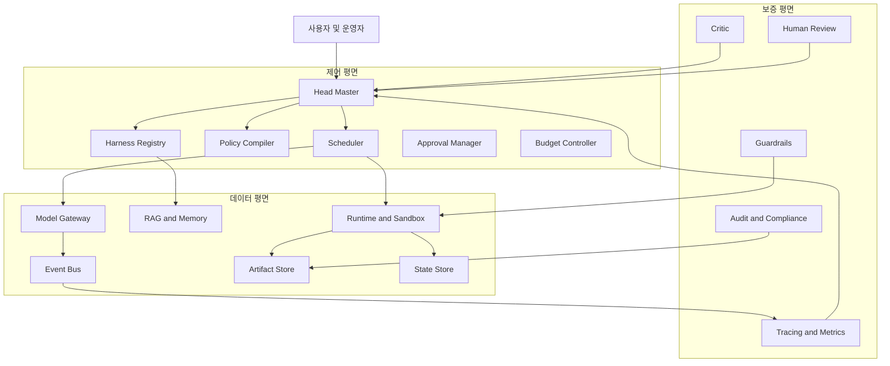
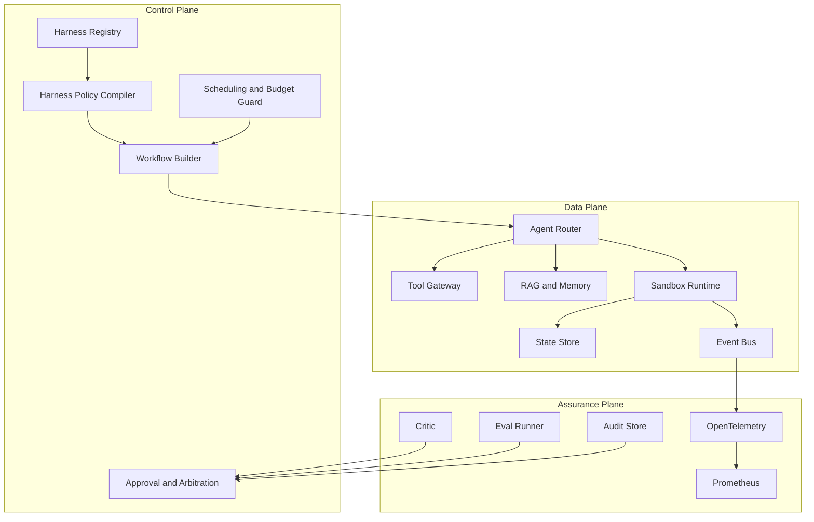
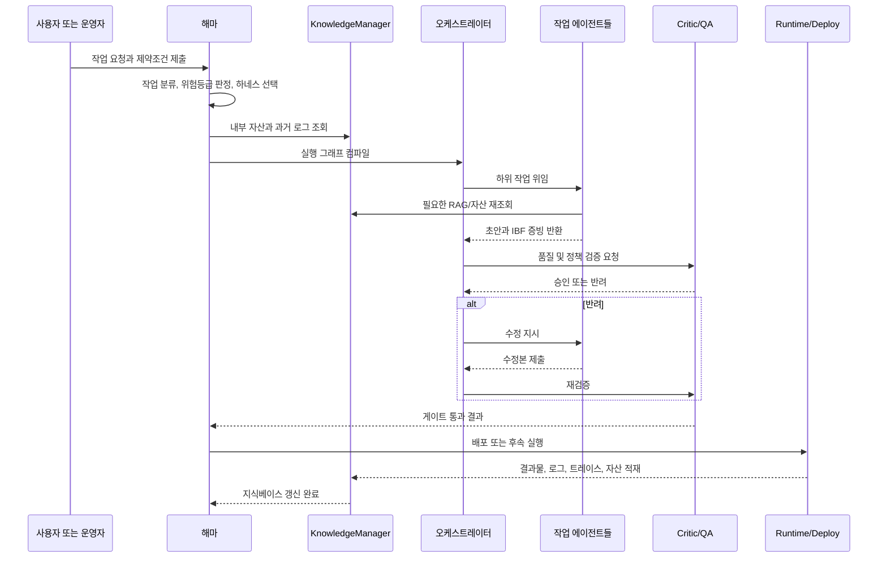

# 해마 기반 오케스트레이터·에이전트 하네스 설계와 운영에 관한 심층 보고서

[마크다운 파일 다운로드](sandbox:/mnt/data/haema_report.md)

본 응답 전체가 원문 마크다운이며, 위 링크는 다운로드용 저장본이다.

## 요약

첨부된 두 문서는 단순한 프롬프트 모음이 아니라, **반(反) 제로샷**, **I-B-F 루프**, **지식 재사용과 유지보수**, **영문 내부 연산과 국문 대면 출력의 분리**, **레드팀 검증 게이트**를 중심으로 움직이는 하나의 운영 철학을 제시한다. 특히 마스터 오케스트레이터 문서는 `@Agent_KnowledgeManager`, `@Agent_Researcher`, `@Agent_Consultant`, `@Agent_Critic`, `@Agent_Planner`, `@Agent_Content`, `@Agent_Design`, `@Agent_Dev_FE/BE`, `@Agent_SecOps`, `@Agent_QA`로 이어지는 역할 분해와 단계별 승인 게이트를 정의하고, 개별 에이전트 문서는 각 역할의 입력·출력 스키마와 I-B-F 준수 방식을 보다 구체적으로 적시한다. 다시 말해 현재 문서는 “작업 수행용 멀티 에이전트 하네스”로서는 상당히 구체적이지만, “여러 작업 유형에 맞추어 하네스 자체를 설계·선택·버전관리·감사·배포하는 상위 관리 평면”까지는 아직 정의하지 않는다. 이 공백을 메우는 메타 제어 계층이 바로 본 보고서가 설계하는 **Head Master, 해마**다. fileciteturn0file0 fileciteturn0file1 citeturn44view0turn20view0turn20view1

본 보고서의 핵심 결론은 다음과 같다. 첫째, 해마는 기존 오케스트레이터를 대체하는 존재가 아니라, **오케스트레이터와 하네스들을 관리하는 상위 제어 평면**이어야 한다. 둘째, 첨부 문서의 “무조건 제로샷 금지” 철학은 생산 환경에서 매우 유용하지만, 이를 텍스트 수준 선언으로만 강제하면 실제로는 위조 가능한 자기보고에 그칠 수 있으므로, **자산 ID, 벤치마크 출처, 트레이스 ID, 산출물 해시를 묶는 기계 판독형 증거 체계**로 격상해야 한다. 셋째, 런타임은 단일 프레임워크 만능주의보다 **하네스 계층, 런타임 계층, 인프라 계층을 분리**하는 편이 안정적이다. LangChain이 구분하듯 프레임워크, 런타임, 하네스는 다른 문제를 푼다. 오케스트레이션 제어와 장기 실행은 LangGraph/Temporal류 런타임이, 도구·승인·상태·추적은 OpenAI Agents SDK류의 코드 우선 패턴이, 정책화된 작업 패키지는 Deep Agents류 하네스가 잘 담당한다. citeturn44view0turn19view2turn19view3turn20view0turn20view1turn22view0turn22view1

따라서 권장 아키텍처는 **제어 평면, 데이터 평면, 보증 평면**의 삼중 구조다. 제어 평면에는 하네스 레지스트리, 정책 컴파일러, 질의 분류기, 스케줄러, 승인 게이트, 예산/쿼터 관리기가 들어간다. 데이터 평면에는 모델 게이트웨이, 도구 어댑터, 이벤트 버스, 상태 저장소, 벡터/RAG 스토어, 아티팩트 저장소, 샌드박스 런타임이 위치한다. 보증 평면에는 Critic, Human-in-the-loop, Guardrail, 평가 파이프라인, 감사 로그, 보안 정책 엔진이 들어간다. 이 구조는 첨부 문서의 I-B-F·RAG·승인 게이트 철학을 유지하면서도, 장기 실행, 장애 복구, 회귀 검증, 롤백, 멀티테넌시, 규제 대응 같은 운영 현실을 수용한다. LangGraph는 지속성·장애 허용·사람 개입·메모리·서브그래프를 제공하는 낮은 수준 오케스트레이션 프레임워크로 정의되고, Temporal은 이벤트 이력 재생을 통해 수년까지도 계속 실행될 수 있는 durable workflow를 제공하며, OpenAI Agents SDK는 서버가 orchestration, tool execution, approvals, state를 소유하는 코드 우선 패턴을 명시한다. citeturn20view0turn21view1turn21view2turn21view3turn22view0turn22view1turn19view2

다만 비판적으로 보면, 첨부 문서의 장점이 곧 리스크이기도 하다. 과거 자산·과거 성공 패턴을 강하게 재사용하는 구조는 산출물 품질을 올리지만, 반대로 **패턴 경직**, **경쟁사 모사에 따른 동형화**, **오래된 레퍼런스의 재유통**, **프롬프트/정책의 자기복제적 보수화**를 야기할 수 있다. 또한 현재 문서의 “영문 내부 처리 / 국문 외부 출력” 규칙은 내부 정규화와 일관성 확보에는 유리하지만, 한국어 법률 문구, 한국형 B2B 구매자 언어, 산업 규격 표현, SEO·AEO·GEO의 현지어 뉘앙스를 손실시킬 위험도 있다. 연구 측면에서도 AgentBench는 장기 추론·의사결정·지시 이행이 여전히 주요 병목임을 보였고, Agent-SafetyBench는 평가 대상 에이전트들 중 어느 것도 60점을 넘지 못했다고 보고했으며, MultiAgentBench는 협업 토폴로지에 따라 성능 차이가 발생한다고 밝힌다. 따라서 해마는 단순한 프롬프트 관리자여서는 안 되고, **평가와 안전을 기본값으로 내장한 운영체제형 플랫폼**이어야 한다. citeturn45academia0turn45academia2turn45academia3turn16view1

기술 스택은 작업 성격에 따라 다르게 조합되겠지만, 본 보고서는 **Python 중심의 에이전트/Eval/RAG 계층 + TypeScript 중심의 API/UI/정적 계약 계층 + Kubernetes 배포 + PostgreSQL 상태 저장 + 객체 저장소 + NATS 이벤트 버스 + OpenTelemetry/Prometheus 관측 + OIDC/Vault 보안 + LangGraph 또는 Temporal 기반 durable orchestration** 조합을 기본안으로 권고한다. 이유는 분명하다. Kubernetes는 컨테이너화된 워크로드에 대한 선언형 구성, 자동 롤아웃/롤백, 셀프힐링, 시크릿 관리를 제공하고, NATS는 pub/sub·request/reply·streaming·JetStream 퍼시스턴스를 단일 시스템으로 제공하며 sub-millisecond latency를 강조한다. OpenTelemetry는 traces/metrics/logs에 대한 vendor-neutral 관측 프레임워크이고, Prometheus는 시계열 수집·경고에 적합하다. citeturn18view1turn18view2turn34view0turn17view1turn17view4

비용 측면에서 보면, 에이전트 시스템의 주비용은 여전히 **토큰 비용과 외부 도구 호출**이다. OpenAI의 2026년 6월 10일 기준 공개 API 가격표에 따르면 GPT-5.5는 입력 100만 토큰당 5달러, 출력 30달러, GPT-5.4는 입력 2.5달러·출력 15달러, GPT-5.4 mini는 입력 0.75달러·출력 4.5달러이며, 웹 검색은 1000콜당 10달러, 컨테이너는 1GB 0.03달러 수준으로 제시된다. 본 보고서가 가정한 중간 규모 운영 시나리오에서는 월 5만 작업 기준으로 **변동 API/도구 비용이 대략 월 4.3천 달러 수준**이며, 여기에 클러스터·스토리지·관측·백업·보안비용을 더하면 현실적인 총비용은 그보다 유의하게 높아질 수 있다. 따라서 해마는 단순 라우팅이 아니라 **비용을 줄이기 위한 모델 라우팅, 캐시, Batch 적용, 비동기화, 고위험 경로에만 고급 모델 배치**까지 수행해야 한다. citeturn36view0

요약하면, 해마의 정체성은 “에이전트를 잘 부리는 오케스트레이터”가 아니라 **작업 유형·위험 수준·도메인 지식·성능 예산·법적 요구·운영 조건에 따라, 어떤 오케스트레이터와 어떤 에이전트 하네스를 어떤 버전으로 어떤 게이트 아래에서 돌릴지를 설계·강제·기록·평가·롤백하는 Head Master**다. 첨부 문서는 그 출발점으로 훌륭하지만, 생산 배포를 위해서는 하네스를 설계 산출물이 아니라 **기계 검증 가능한 제품 자산**으로 다루는 체계, 즉 해마가 필요하다. fileciteturn0file0 fileciteturn0file1 citeturn44view0turn22view1turn19view2turn20view1

## 분석 대상과 전제

본 보고서는 사용자가 첨부한 `Master Orchestrator Harness v8.0`와 `System harness for individual agents`를 1차 설계 입력으로 사용했다. 전자는 B2B/엔터프라이즈 웹사이트 제작을 위한 멀티 에이전트 워크플로의 마스터 오케스트레이터 규격서이고, 후자는 그 철학을 상속한 개별 에이전트 하네스 묶음이다. 두 문서는 공통적으로 **No Zero-Shot Invention**, **I-B-F(Imitate, Benchmark, Fusion)**, **KnowledgeManager 중심의 선행/사후 지식 순환**, **English-Core / Korean-Edge**, **Critic에 의한 승인 게이트**를 핵심 규범으로 둔다. 즉, 현재의 설계는 “창의적 프롬프트 엔지니어링”보다 “검증된 자산의 조합적 재사용”을 우선시한다. fileciteturn0file0 fileciteturn0file1

문서에서 직접 확인되는 가장 중요한 특징은 다섯 가지다. 첫째, 오케스트레이터는 작업 실행 이전에 반드시 KnowledgeManager로부터 과거 자산을 불러오고, Researcher가 경쟁사 벤치마크를 수집해야 한다고 강제한다. 둘째, Execution Team은 Planner, Content, Design, Dev류 역할로 분리되어 있으며, 각 산출물에는 “무엇을 모방했고 무엇을 벤치마크했는가”에 대한 증빙이 포함되어야 한다. 셋째, Critic은 그 증빙이 없거나 융합이 부자연스러우면 즉시 반려한다. 넷째, Phase 0에서 Phase 7까지의 게이트 구조가 있으며, 마지막 Phase 7은 결과물을 다시 Knowledge Base에 축적해 다음 프로젝트의 모방 베이스로 재사용하게 만든다. 다섯째, 개별 에이전트 문서는 이러한 철학을 각 에이전트별 JSON/Markdown schema 수준으로 더 구체화한다. 이 다섯 가지는 현재 문서가 이미 “하네스”라는 개념을 상당 부분 구현하고 있음을 보여준다. fileciteturn0file0 fileciteturn0file1

그러나 생산 수준의 해마를 설계하는 데 필요한 정보는 문서에 다 나오지 않는다. 문서에는 런타임이 LangGraph인지 Temporal인지, 혹은 OpenAI Agents SDK인지가 명시되지 않는다. 상태 저장소, 이벤트 버스, 시크릿 관리, 감사 로그의 영속성, 멀티테넌시 경계, 데이터 보존 주기, PII 처리 분류, 사람 승인 임계값, 장애 조치 방식, SLO/SLA, 비용 상한, 평가 데이터셋, 모델 라우팅 규칙, 온프레미스/클라우드 배포 전략도 제시되지 않는다. 따라서 본 보고서는 첨부 문서의 철학을 최대한 보존하되, 비어 있는 부분은 **명시적 가정**으로 채운다. 이 점은 설계 추정의 한계이자, 동시에 해마가 왜 필요한지 보여주는 증거이기도 하다. 현재 문서는 “작업 지시 규격”에 가깝고, 해마는 “작업 지시 규격을 운영 제품으로 만드는 플랫폼”이어야 하기 때문이다. fileciteturn0file0 fileciteturn0file1 citeturn44view0turn22view1

아래 전제는 문서 공백을 메우기 위해 명시적으로 도입한 가정이다.

| 전제 항목 | 본 보고서의 가정 | 근거와 해설 |
|---|---|---|
| 적용 범위 | 첨부 문서는 B2B 웹사이트 제작 도메인용이지만, 해마 설계는 이를 **도메인 일반화 가능한 멀티 에이전트 플랫폼**으로 확장한다 | 첨부 문서는 웹사이트 제작 도메인을 전제로 하지만, 역할·게이트·지식 순환 구조는 일반화 가능하다. fileciteturn0file0 fileciteturn0file1 |
| 하네스 정의 | 하네스는 “프롬프트 묶음”이 아니라 **정책화된 실행 패키지**다 | LangChain 문서는 하네스를 prebuilt tools, prompts, subagents를 갖춘 opinionated layer로 구분한다. citeturn44view0turn20view1 |
| 해마 역할 | 해마는 오케스트레이터 상위의 **메타 제어 평면**이다 | 첨부 문서가 제시한 것은 실행용 오케스트레이터이지 하네스 관리 플랫폼이 아니므로, 그 위에 별도 계층이 필요하다는 것이 본 보고서의 설계 판단이다. fileciteturn0file1 citeturn44view0turn22view1 |
| 런타임 유형 | 장기 실행과 실패 복구를 고려해 **durable runtime**을 기본 전제로 둔다 | LangGraph는 persistence/fault tolerance를, Temporal은 replay 기반 durable workflow를 제공한다. citeturn20view0turn22view0turn22view1 |
| 통신 방식 | 내부 제어는 gRPC/HTTP, 비동기 조정은 이벤트 버스, 도구 호출은 MCP, 외부 에이전트 협업은 A2A를 기본값으로 둔다 | gRPC, MCP, A2A, ACP는 서로 다른 상호운용 문제를 푼다. citeturn33view1turn29view0turn32view0turn29view2 |
| 보안 모델 | 제로 트러스트와 최소권한을 기본으로 둔다 | OWASP GenAI Security Project와 Agent-SafetyBench는 프롬프트/도구/환경 통합 시 안전 이슈가 커진다고 본다. citeturn16view1turn45academia2 |
| 품질 측정 | 평가 없는 운영은 허용하지 않는다고 가정한다 | OpenAI Agents SDK 문서는 tracing과 workflow evaluation을 명시적으로 강조한다. citeturn19view2turn19view4 |
| 비용 모델 | 공개 가격은 모델/API 비용에만 적용하고, 인프라 비용은 **명시한 가정값**으로 별도 산정한다 | 공개적으로 확인 가능한 것은 API/도구 가격표이며, 클라우드 인프라 단가는 배포 선택에 따라 크게 달라진다. citeturn36view0 |

이러한 전제는 임의 추정이 아니라, 문서의 의도와 현재 공개 구현체들이 제공하는 능력의 교집합을 기반으로 한 설계적 해석이다. 특히 LangChain 개념 문서가 프레임워크, 런타임, 하네스를 분리하고, OpenAI Agents SDK가 orchestration·approvals·state·tracing의 서버 소유 모델을 분명히 하며, Temporal이 외부 세계와의 상호작용을 activity로 분리해 내결정적 재생을 가능하게 만드는 점은, 해마가 반드시 **실행 지시와 운영 통제를 구분**해야 한다는 결론을 강하게 지지한다. citeturn44view0turn19view2turn22view0

## 핵심 개념과 설계 원칙

우선 용어를 정리할 필요가 있다. 첨부 문서의 맥락에서 **에이전트**는 특정 역할을 맡은 전문 작업자다. Researcher는 외부 벤치마크를 추출하고, KnowledgeManager는 내부 자산을 공급·유지하며, Critic은 반려·검증을 수행하고, Planner·Content·Design·Dev는 실제 작업 산출물을 만든다. **오케스트레이터**는 이 전문 작업자들을 순서대로 혹은 조건부로 호출하고, 단계 게이트를 통제하며, 전체 작업의 PM 겸 퍼널 매니저 역할을 한다. **하네스**는 이 에이전트와 오케스트레이터가 따르는 정책화된 실행 패키지다. LangChain은 프레임워크·런타임·하네스를 구분하면서, 하네스를 “planning, file systems, subagents, token/context management가 내장된 opinionated, batteries-included layer”로 설명하고, Deep Agents를 그 예로 든다. 이 정의는 첨부 문서의 구조와 매우 잘 맞는다. fileciteturn0file0 fileciteturn0file1 citeturn44view0turn20view1

이 틀에서 본 보고서가 제안하는 **Head Master, 해마**는 다음과 같이 정의된다. 해마는 “특정 작업을 직접 수행하는 에이전트”도 아니고, “단일 작업 흐름을 실행하는 오케스트레이터”도 아니다. 해마는 **작업 유형, 위험 수준, 도메인 지식, 성능 예산, 데이터 민감도, 법적 요구, 운영 상태에 따라 어떤 하네스를 어떤 오케스트레이터 위에서 어떤 버전으로 어떤 승인 규칙 아래 돌릴지를 결정하고, 그 실행 증거를 저장하며, 성능·비용·안전을 지속적으로 보정하는 관리 계층**이다. 다시 말해 해마는 **Harness Engineering & Management Authority**에 가까운 존재다. 이 정의는 첨부 문서에 직접 쓰여 있지는 않지만, 현재 문서가 이미 하네스적 성격을 강하게 띠고 있으며, 그 위에 하네스 생명주기 관리 기능이 부재하다는 점에서 자연스럽게 도출된다. fileciteturn0file0 fileciteturn0file1 citeturn44view0turn20view0turn19view2

이 개념 분리는 실무적으로 매우 중요하다. 많은 팀이 Kubernetes, Airflow, LangGraph, Agents SDK, MCP, A2A를 한 덩어리로 부르며 “오케스트레이션”이라고 말하지만, 실제로 각각이 해결하는 층위는 다르다. Kubernetes 문서는 Kubernetes가 선언된 워크플로를 순차 실행하는 의미의 전통적 orchestration과는 다르며, 원하는 상태를 향해 독립적인 control process들이 현재 상태를 지속적으로 수렴시키는 시스템이라고 설명한다. 반면 LangGraph는 라우팅, orchestrator-worker, evaluator-optimizer 같은 작업 제어 패턴을 직접 다룬다. Temporal은 event history 기반 replay와 activity 분리를 통해 장기 실행과 복구를 해결한다. OpenAI Agents SDK는 하나 이상의 agent와 handoff, guardrails, human review, tracing을 중심으로 “서버가 orchestration을 소유하는” 패턴을 제시한다. 결국 해마가 설계돼야 하는 문제는 인프라 스케줄링이 아니라 **정책화된 작업 통제**이며, 이 통제는 인프라·런타임·하네스를 서로 다른 계층으로 보지 않으면 제대로 구현되지 않는다. citeturn18view2turn21view1turn21view2turn21view3turn22view0turn19view2

첨부 문서에 비추어 볼 때, 해마가 반드시 채택해야 할 설계 원칙은 일곱 가지다. 첫째, **정책 우선**이다. 프롬프트보다 먼저 어떤 작업이 어떤 조건과 증빙 규칙 아래 수행되어야 하는지가 컴파일되어야 한다. 둘째, **상태 우선**이다. 작업이 길어질수록 메모리보다 durable state가 중요하다. 셋째, **증거 결합형 위임**이다. “무엇을 모방했고 무엇을 벤치마크했는가”는 텍스트 설명이 아니라 참조 가능한 artifact lineage여야 한다. 넷째, **관측 가능성 내장**이다. 추적과 평가가 없으면 Multi-agent 시스템은 디버깅이 아니라 추측의 대상이 된다. 다섯째, **제약된 자율성**이다. 자유로운 에이전트 협업은 매력적이지만, Agent-SafetyBench가 보여주듯 안전 문제는 여전히 심각하므로, human review와 policy gate를 기본값으로 둬야 한다. 여섯째, **버전 우선**이다. 하네스, 프롬프트, 도구 권한, 평가 세트, 안전 규칙을 모두 버전관리해야 한다. 일곱째, **지식의 자본화**다. 첨부 문서의 Phase 7 정신을 확장해, 해마는 매 프로젝트를 다음 프로젝트의 자산으로 변환해야 한다. fileciteturn0file1 citeturn19view3turn19view4turn20view0turn22view1turn45academia2turn17view1

이 원칙들을 현재 연구와 대조하면 더 분명해진다. ReAct는 추론과 행동을 교차시키는 구조가 hallucination과 오류 전파를 줄이고 외부 정보원과의 상호작용을 개선할 수 있음을 보여줬다. Toolformer는 모델이 언제 어떤 도구를 호출할지 학습하는 방향을 제시했고, Reflexion은 에이전트가 자신의 실패를 언어화된 메모리로 반영할 수 있음을 보였다. CAMEL, MetaGPT, ChatDev, AutoGen은 역할 기반 다중 에이전트 협업을 다양한 방식으로 실험했다. 하지만 AgentBench는 장기 추론과 현실적 환경 적응의 병목을, Agent-SafetyBench는 안전 격차를, MultiAgentBench는 협업 구조와 토폴로지 차이의 중요성을 드러냈다. 즉, 해마 설계는 “에이전트를 더 많이 붙이는 것”이 아니라, **역할·도구·기억·검증·토폴로지의 조합을 통제하는 것**이어야 한다. citeturn27academia1turn27academia3turn28academia0turn27academia0turn27academia2turn28academia2turn28academia1turn45academia0turn45academia2turn45academia3

여기서 첨부 문서의 가장 훌륭한 점은 “혁신이란 무(無)에서의 창조가 아니라 우수한 모방과 벤치마크의 맥락화된 융합”이라는 실무적 통찰이다. 실제로 생산 시스템의 안정성은 자유로운 창작보다 재현 가능한 패턴에서 더 쉽게 나오며, Rakuten 사례에서도 재사용 가능한 프레임워크와 실험/평가 인프라가 속도와 신뢰성을 높이는 핵심으로 제시된다. 하지만 동시에 가장 위험한 점도 여기에 있다. 해마가 이 철학을 제어 장치 없이 확대하면, 시스템은 시간이 흐를수록 “새로운 성공 패턴을 발견하는 구조”가 아니라 “과거 성공을 반복 인용하는 구조”로 굳을 수 있다. 따라서 해마는 I-B-F의 마지막 F를 단순한 Fusion이 아니라 **Freshness-aware Fusion**, 즉 신선도·출처 다양성·권리 적합성·도메인 적합성 평가를 포함한 융합으로 업그레이드해야 한다. citeturn38view0turn45academia3turn45academia2

이를 실무 용어로 풀면, 해마는 네 개의 계약을 다뤄야 한다. **작업 계약**은 목적, 성공 기준, 시간 예산, 비용 예산, 승인 조건을 규정한다. **에이전트 계약**은 역할, 입력 스키마, 출력 스키마, 도구 권한, 금지 행위, 언어 정책을 규정한다. **아티팩트 계약**은 산출물의 저장 위치, 버전, 품질 기준, 저작권/출처 증빙 규칙을 규정한다. **평가 계약**은 자동 평가 세트, 반려 규칙, 오류 분류, 회귀 허용치, 롤백 기준을 규정한다. 첨부 문서는 이미 에이전트 계약의 초안을 갖고 있으며, 해마는 이 네 계약을 Versioned Manifest로 승격시키는 역할을 맡아야 한다. fileciteturn0file0 fileciteturn0file1 citeturn19view2turn19view3turn20view1turn22view1

## 참조 아키텍처와 하네스 설계

해마의 참조 아키텍처는 “무슨 모델을 쓰는가”보다 “어떤 통제 경로로 작업이 실행되는가”를 먼저 정의해야 한다. 본 보고서는 이를 **제어 평면, 데이터 평면, 보증 평면**으로 나눈다. 제어 평면은 정책과 실행 그래프를 결정한다. 데이터 평면은 실제 모델 호출·도구 실행·상태 저장·메시지 전달을 담당한다. 보증 평면은 보안·안전·품질·감사·사람 개입을 담당한다. 이 분리는 첨부 문서가 제시한 I-B-F·Critic·KnowledgeManager·Phase Gate를 운영 체계 수준으로 승격시키는 가장 합리적인 방식이다. LangGraph가 orchestration patterns와 persistence를, Temporal이 durable execution과 event history를, OpenAI Agents SDK가 orchestration·approvals·state·tracing을, Kubernetes가 rollout/rollback·self-healing·secret management를 맡는다는 점을 종합하면 이 삼중 구조가 자연스럽다. fileciteturn0file1 citeturn20view0turn21view1turn22view0turn19view2turn18view2

해마의 위치를 시각화하면 아래와 같다.




이 구조에서 해마의 실질적 핵심은 **Harness Registry**다. 현재 첨부 문서의 개별 에이전트 프롬프트는 사람이 읽기에 좋은 Markdown 형식이지만, 운영 환경에서는 이를 **기계 판독형 manifest**로 변환해야 한다. 예를 들어 하나의 하네스는 `task_class`, `risk_tier`, `required_roles`, `model_routes`, `ibf_requirements`, `language_policy`, `tool_policy`, `approval_gates`, `memory_hooks`, `benchmark_policy`, `output_contract`, `eval_suite`, `rollback_policy` 같은 필드를 가져야 한다. 이때 첨부 문서의 `IBF_Proof_EN`, `SEO_Schema_EN`, `Design_Tokens`, `zero_shot_detected`, `maintenance_log` 같은 출력 스키마는 그대로 재사용할 수 있다. 다만 해마는 이를 텍스트 블록이 아니라 검증 가능한 schema contract로 변환해야 한다. 그래야 Critic이 문장 표현이 아니라 실제 참조 ID와 추적 데이터로 pass/fail을 판정할 수 있다. fileciteturn0file0 fileciteturn0file1 citeturn19view2turn19view4turn20view1

예시적으로, 해마가 관리하는 하네스 manifest는 아래와 같은 구조를 가질 수 있다.

```yaml
harness_id: b2b-site-v1
version: 1.0.0
task_class: enterprise_web_build
risk_tier: medium
language_policy:
  internal: en
  external: ko
required_roles:
  - knowledge_manager
  - researcher
  - consultant
  - critic
  - planner
  - content
  - design
  - dev
  - secops
  - qa
ibf_requirements:
  must_reference_internal_assets: true
  must_reference_external_benchmarks: true
  proof_format:
    - asset_ids
    - benchmark_uris
    - trace_ids
    - artifact_hashes
approval_gates:
  - reverse_proposal_signoff
  - critic_gate
  - security_gate
  - qa_gate
tool_policy:
  mcp_allowed: [search, repo, file, browser]
  sandbox_required: true
  external_write_requires_human_approval: true
output_contract:
  schemas:
    - sitemap_json
    - content_md
    - design_tokens_json
    - code_bundle
eval_suite:
  - regression_golden_set
  - style_guard
  - security_checks
  - localization_checks
rollback_policy:
  strategy: version_pin_and_redeploy
```

현재 첨부 문서가 가진 강점은 이 manifest의 철학적 내용이 이미 대부분 정의돼 있다는 점이다. 예를 들어 “No Zero-Shot Invention”, “English-Core/Korean-Edge”, “Pre-work / Post-work”, “Critic approval gates”, “Maintenance of knowledge base”가 이미 명시돼 있다. 문제는 그것이 아직 **운영 산출물**이 아니라 **사람이 해석하는 규범형 문서**라는 점이다. 해마는 이 해석 가능한 문서를 컴파일하여, 런타임이 실행 가능한 **Harness IR(Intermediate Representation)** 형태로 내려줘야 한다. 그래야 작업마다 적절한 오케스트레이터 그래프를 자동 생성할 수 있다. LangGraph의 orchestrator-worker 패턴과 routing, evaluator-optimizer 패턴은 바로 이런 Harness IR의 실행 백엔드로 적합하다. fileciteturn0file1 citeturn21view1turn21view2turn21view3

해마가 내려주는 오케스트레이션 그래프는 작업 유형별로 달라져야 한다. 예를 들어 정보 탐색형 작업은 `Researcher -> Synthesizer -> Critic`으로 구성될 수 있고, 문서 생성형 작업은 `KnowledgeManager -> Planner -> Worker parallel fan-out -> Synthesizer -> Critic -> QA` 구조가 적합하다. 위험 작업은 `Critic -> HumanReview -> SecOps`를 추가하고, IDE 연계 코딩 작업은 ACP 경로를 활성화해야 한다. LangChain 문서는 ACP가 코딩 에이전트와 코드 에디터/IDE 간 표준화된 통신을 제공한다고 설명하고, MCP는 agent-to-tool 연결, A2A는 agent-to-agent 상호운용에 적합하다고 구분한다. 해마가 해야 하는 일은 이들 프로토콜을 모두 동일선상에서 보는 것이 아니라, **각 프로토콜을 올바른 층위에 연결하는 것**이다. ACP는 IDE 통합, MCP는 툴 호출, A2A는 이종 원격 에이전트 간 협업, gRPC/HTTP는 내부 서비스 제어에 쓰는 식으로 정리해야 한다. citeturn29view2turn29view0turn32view0turn33view1

이 지점에서 통신 프로토콜 선택은 구조적으로 중요하다. **gRPC**는 내부 마이크로서비스 호출과 typed contract에 적합하다. 공식 소개 문서가 말하듯 proto 기반 서비스 정의와 다언어 스텁 생성은 분산 시스템 제어에 유리하다. **NATS**는 agent coordination, queue group, request/reply, JetStream persistence가 필요할 때 간결하고 빠른 실시간 fabric을 제공한다. **Kafka**는 이벤트 스트리밍, 장기 보존, 분석용 이벤트 허브가 중요할 때 적합하다. 따라서 해마는 일반적으로 NATS를 실시간 조정 버스로, Kafka 또는 객체 저장소+데이터 레이크를 분석/감사용 장기 이벤트 저장으로 분리하는 편이 낫다. 둘을 모두 쓰기 싫다면 초기에는 NATS JetStream 하나로 시작하고, 대규모 분석 또는 정확한 replay 요구가 생길 때 Kafka 계층을 늘리는 전략이 비용과 복잡도 측면에서 현실적이다. citeturn33view1turn34view0turn35view0

해마 아키텍처의 구성요소를 좀 더 세분화하면 다음과 같다.




이 컴포넌트 설계에서 가장 새롭게 강조할 부분은 **증거 결합형 I-B-F 검증기**다. 첨부 문서는 Critic이 “무엇을 모방했고 무엇을 벤치마크했는지”를 묻도록 설계하지만, 현재 형태는 자기보고형 설명에 가깝다. 해마에서는 이를 다음 네 단계로 바꿔야 한다. 첫째, KnowledgeManager가 공급한 internal asset에는 immutable asset ID와 version hash를 부여한다. 둘째, Researcher가 수집한 benchmark에는 URI, 수집 시각, 파싱 결과, 사용 허용 범위를 기록한다. 셋째, 작업 중 생성된 intermediate draft와 final artifact에는 trace span ID를 연결한다. 넷째, Critic은 텍스트 설명이 아니라 이 네 필드의 존재와 일관성을 검사해 승인한다. 이 방식은 단순 prompt obedience를 넘어 **provenance-aware orchestration**이 된다. Agent-to-Agent와 MCP 생태계가 확대되더라도, identity와 delegation을 제대로 검증하지 않으면 provenance가 쉽게 위조될 수 있다는 최근 연구의 문제의식과도 맞닿아 있다. fileciteturn0file0 fileciteturn0file1 citeturn30academia2turn32view0turn29view0

실행 흐름은 아래와 같이 설계할 수 있다.




이 흐름에서 해마와 오케스트레이터의 경계가 가장 중요하다. 오케스트레이터는 “이번 한 번의 작업”을 푼다. 해마는 “이 작업을 푸는 데 사용할 하네스와 그래프와 승인 정책과 비용 제한을 결정하고, 결과를 다음 작업의 자산으로 편입할지 판단한다.” 그래서 오케스트레이터가 PM이고, 해마는 PMO 내지 운영위원회에 가깝다. 첨부 문서가 현재 오케스트레이터 안에 품고 있는 KnowledgeManager, Critic, Phase Gate, Maintenance 정신을 상위 플랫폼으로 끌어올리면, 동일 작업 로직을 다양한 도메인으로 복제할 수 있다. 예를 들어 법률 문서 초안, 제품 카탈로그 관리, incident response runbook 생성, 데이터 품질 진단 같은 다른 업무에도, KnowledgeManager/Researcher/Critic의 기본 골격은 유지한 채 Planner/Content/Dev 역할만 바꾸면 된다. 바로 이 재사용성을 위해 해마는 **역할을 프롬프트가 아니라 계약과 레지스트리의 단위로 다뤄야** 한다. fileciteturn0file0 fileciteturn0file1 citeturn44view0turn20view1turn22view1

데이터 흐름 관점에서 보면, 해마는 최소한 여섯 종류의 저장소를 구분해야 한다. 하나는 **운영 상태 저장소**다. 작업 ID, 단계, 승인 상태, 재시도 횟수, 비용 누적치, human review status 같은 durable state가 들어간다. 둘째는 **RAG/메모리 저장소**다. 과거 자산, 템플릿, conflict log, benchmark summary가 들어간다. 셋째는 **아티팩트 저장소**다. 최종 보고서, 코드 번들, 디자인 토큰, QA 리포트가 저장된다. 넷째는 **이벤트 저장소**다. 런타임 이벤트, retry, failure, external call log가 들어간다. 다섯째는 **관측 저장소**다. trace, metric, log가 집약된다. 여섯째는 **감사 저장소**다. 누가 언제 어떤 하네스를 어떤 버전으로 실행했고 승인했는지, 어떤 데이터가 외부로 나갔는지가 들어간다. OpenTelemetry와 Prometheus 조합은 관측 저장소를, PostgreSQL과 객체 저장소는 상태/아티팩트 저장을, 이벤트 버스는 런타임 조정을, Temporal 또는 LangGraph는 durable execution layer를 맡기에 적합하다. citeturn17view1turn17view4turn22view1turn20view0

## 구현 기술 스택과 통합 배포 전략

구현 스택을 고를 때 중요한 것은 “무엇이 유행하는가”가 아니라 “어느 층의 문제를 해결하느냐”다. 해마 자체는 정책 컴파일러·레지스트리·승인 시스템·관측 대시보드·배포 제어를 포함하는 플랫폼이므로, **정형 계약과 웹 인터페이스에 강한 TypeScript/Node 계층**과, **에이전트 로직·RAG·Evals·데이터 파이프라인에 강한 Python 계층**의 혼합이 가장 현실적이다. 이때 Python은 에이전트 하네스 정의, 모델 라우팅, 데이터 준비, 평가 파이프라인, 샌드박스 작업에 쓰고, TypeScript는 API Gateway, Control UI, Approval Console, Policy Compiler, SDK integration에 쓰는 식으로 분할하면 좋다. OpenAI Agents SDK가 TypeScript와 Python 둘 다를 지원하고, OpenAI 쪽 문서가 typed application code와 custom storage, server-owned orchestration을 강조하는 점은 이 혼합 전략을 뒷받침한다. citeturn19view2turn24view1turn24view2

런타임 선택에서는 단일 승자를 강요하기보다 **계층형 선택**이 낫다. 첫 번째 선택지는 **LangGraph 중심안**이다. LangGraph는 long-running, stateful agents를 위한 낮은 수준 orchestration framework/runtime으로 정의되며 persistence·fault tolerance·human-in-the-loop·memory·subgraphs를 제공한다. 첨부 문서가 이미 routing, orchestrator-worker, critic gate, knowledge reuse 같은 패턴을 본질로 삼고 있다는 점에서 LangGraph는 문서 철학과 가장 직접적으로 맞닿아 있다. 하네스 계층으로는 Deep Agents 스타일을 결합하여 planning, subagents, file system, context management를 끌어올릴 수 있다. 두 번째 선택지는 **Temporal 중심안**이다. Temporal은 코드로 워크플로를 정의하고 event history replay를 통해 장기간 안정적으로 재개하며, 외부 세계와의 상호작용은 activity로 분리한다. 문서가 강하게 요구하는 “실패 후에도 이어서 수행”, “승인 게이트 후 재개”, “장기 프로젝트 자산화”에는 Temporal이 매우 강력하다. 세 번째는 **혼합안**인데, 해마의 상위 상태 머신과 승인/배포는 Temporal, 개별 agent graph는 LangGraph 또는 Agents SDK 위에서 수행하는 방식이다. 이 혼합안이 가장 무겁지만, 대기업 환경에서는 가장 설득력이 있다. citeturn20view0turn20view1turn44view0turn22view0turn22view1

도구·프로토콜 층에서는 명확한 역할 분담이 필요하다. **MCP**는 에이전트가 데이터 소스, 툴, 워크플로에 표준 방식으로 연결되도록 하는 open-source standard다. 따라서 사내 검색, 문서 저장소, 이슈 트래커, DB 조회, 코드 저장소, 캘린더, 티켓 시스템은 MCP 서버로 노출하고, 하네스는 필요한 서버만 허용하는 식으로 관리하는 것이 바람직하다. **A2A**는 외부 조직이나 다른 프레임워크의 원격 에이전트와 협업하는 표준으로, Agent Card와 agent interoperability를 핵심으로 한다. 즉, 여럿의 자사 에이전트는 MCP와 내부 이벤트 버스로 묶고, 외부 파트너 에이전트나 타 부서의 독립 시스템과는 A2A로 연결하는 식이 좋다. **ACP**는 IDE/에디터 통합용으로 국한하는 것이 안전하다. 프로토콜을 섞되 각기 다른 계층에 쓰는 것이지, 모든 호출을 하나의 프로토콜로 통일하려는 시도는 오히려 복잡도를 높인다. citeturn29view0turn32view0turn29view2

메시징은 기본적으로 **NATS 우선, Kafka 선택적 보강**을 권한다. NATS는 pub/sub, request/reply, queueing, streaming, key-value, object storage를 단일 시스템 안에서 제공하고, 분산된 agents and applications를 위한 real-time communication fabric을 표방한다. 이는 해마에서 필요한 빠른 제어 이벤트와 짧은 피드백 루프에 적합하다. 반면 Kafka는 durable event streaming, long retention, exactly-once, 분석·리플레이 친화성이 강하다. 따라서 운영 제어용 버스로는 NATS, 대규모 이벤트 분석·원장형 감사·ML feature ingestion에는 Kafka를 두는 이원화가 유용하다. 다만 초기 단계에는 한 시스템으로 시작하는 편이 좋고, 실제로 일어나는 실패 유형과 분석 요구가 확인된 뒤 분리해야 한다. 첨부 문서가 아직 이벤트 볼륨이나 리텐션 요구를 밝히지 않았다는 점을 고려하면, 해마의 초기 구현은 NATS 단일화를 기본안으로 보고, 대규모 enterprise 전개 때 Kafka를 추가하는 경로가 합리적이다. citeturn34view0turn35view0turn0file1

컨테이너화와 배포는 Kubernetes가 가장 무난하다. 공식 문서가 말하듯 Kubernetes는 containerized workloads and services에 대해 선언형 구성, 자동 롤아웃/롤백, 자동 bin packing, self-healing, secret/config management를 제공한다. 첨부 문서의 실행 팀과 방어 팀 구분, 단계별 gate, 코드/자산/보안 검증 흐름을 생각하면, 에이전트 런타임을 Job/Deployment/Workflow 자원으로 나누고, 해마는 이를 제어하는 상위 서비스가 되는 구조가 자연스럽다. 단, 중요한 점은 Kubernetes 자체가 애플리케이션 수준의 workflow engine이 아니라는 것이다. Kubernetes 문서도 이를 명확히 말한다. 그러므로 해마는 Kubernetes 위에서 돌아가되, 작업 제어는 LangGraph/Temporal/Agents SDK/자체 워크플로 엔진이 맡도록 분리해야 한다. citeturn18view1turn18view2

관측과 로깅에 대해서는 타협의 여지가 거의 없다. **OpenTelemetry**는 traces, metrics, logs를 생성·수집·내보내는 vendor-neutral open-source observability framework다. 이는 해마가 특정 관측 벤더에 종속되지 않고, 에이전트 span, tool call span, human approval span, benchmark fetch span, critic rejection span을 일관된 trace로 묶는 데 적합하다. **Prometheus**는 시계열 수집과 경고에 적합하고, pull model과 standalone 특성 때문에 장애 시에도 빠른 판단에 유리하다. Prometheus 문서가 billing 같은 100% 정확성 요구에는 맞지 않는다고 설명하는 점은 중요한 운영 교훈이다. 즉, 해마의 비용 집계는 billing 데이터나 provider usage API를 기준으로 해야 하고, Prometheus는 운영 진단과 임계치 경보용으로 써야 한다. citeturn17view1turn17view4

CI/CD는 하네스 기반 시스템에 맞게 재해석되어야 한다. 전통적 애플리케이션처럼 “코드 빌드 후 배포”만으로 끝나지 않는다. 해마에서의 배포 단위는 최소 다섯 가지다. **하네스 버전**, **모델 라우팅 정책**, **도구 권한 세트**, **평가 세트**, **런타임 코드**다. 따라서 CI 파이프라인은 첫 단계에서 markdown/yaml 하네스 lint와 schema validation을 수행하고, 두 번째 단계에서 golden traces 및 regression eval을 돌리며, 세 번째 단계에서 sandbox integration test와 security scan을 수행하고, 네 번째 단계에서 canary 또는 shadow traffic 하에 배포해야 한다. OpenAI Agents SDK가 evaluation workflows와 tracing을 문서 항목으로 명시하고, LangGraph가 production structure/test/backward compatibility를 별도 항목으로 제시한다는 점은 이러한 배포 관점을 지지한다. 즉, 해마의 CI/CD는 애플리케이션 배포이면서 동시에 **정책 배포**여야 한다. citeturn19view2turn19view4turn20view0

롤백도 코드 롤백 하나로 끝나면 안 된다. 해마에서는 최소한 세 종류의 롤백이 필요하다. **정책 롤백**은 하네스 버전과 tool policy를 되돌리는 것이다. **그래프 롤백**은 오케스트레이터 실행 토폴로지를 이전 상태로 되돌리는 것이다. **산출물 롤백**은 배포된 결과물을 이전 승인 버전으로 교체하는 것이다. Kubernetes의 rollout/rollback과 Temporal의 durable workflow state, LangGraph의 persistence/time-travel 개념을 조합하면 이런 롤백 체계 설계가 가능하다. 중요한 것은 “어느 버전에서 어떤 Prompt/Tool/Model/Eval 조합이 나쁜 결과를 냈는지”를 관측 가능한 형태로 기록하는 일이다. 이것이 없으면 롤백은 복구가 아니라 복불복이 된다. citeturn18view2turn22view1turn20view0

아래는 권장 기술 스택을 층위별로 요약한 것이다.

| 층위 | 권장 기본안 | 대안 | 선택 이유 |
|---|---|---|---|
| 해마 제어 평면 | TypeScript/Node + Python control services | 순수 Python | API/UI/정적 계약에 강하고, Python 에이전트 계층과 병행하기 좋다. citeturn19view2turn24view1turn24view2 |
| 에이전트 런타임 | LangGraph 또는 Temporal | OpenAI Agents SDK 중심 단일안 | LangGraph는 상태성/그래프 패턴, Temporal은 durable replay, Agents SDK는 code-first orchestration과 handoff/guardrails에 강하다. citeturn20view0turn22view0turn19view2 |
| 하네스 계층 | Deep Agents 스타일 custom harness | 직접 구현 | planning, subagents, file systems, context management 같은 하네스 기능이 이미 잘 정의돼 있다. citeturn20view1turn44view0 |
| 내부 RPC | gRPC + Protobuf | HTTP/JSON only | typed contract, 다언어 스텁, 분산 서비스 제어에 유리하다. citeturn33view1 |
| 도구 호출 | MCP | 직접 REST adapter | 표준화된 agent-to-tool 연결. citeturn29view0 |
| 외부 에이전트 협업 | A2A | bespoke API | 이종 프레임워크 간 agent interoperability에 적합하다. citeturn32view0 |
| IDE 연계 | ACP | editor-specific plugin | agent-editor 표준화에 유리하다. citeturn29view2 |
| 이벤트 버스 | NATS | Kafka | 실시간 coordination에 단순·빠르다. Kafka는 장기 이벤트 분석에 보강재로 좋다. citeturn34view0turn35view0 |
| 상태 저장 | PostgreSQL + Object Store | NoSQL + Blob | 실행 상태와 감사에 관계형 저장소가 유리하고, 대용량 산출물은 객체 저장소가 적합하다. Temporal/LangGraph 패턴과도 잘 맞는다. citeturn22view1turn20view0 |
| 관측 | OpenTelemetry + Prometheus | 벤더 단일 SaaS | 락인 회피와 표준 trace/metric 수집. citeturn17view1turn17view4 |
| 배포 | Kubernetes | VM / managed PaaS | self-healing, rollout/rollback, secret/config, batch/CI workloads 운영에 유리하다. citeturn18view1turn18view2 |

## 비교 연구와 비판 검증

첨부 문서와 해마 설계를 엄밀하게 평가하려면, “현재 연구가 무엇을 보여주고 있는가”와 “현재 구현체들이 어디까지 성숙했는가”를 나누어 봐야 한다. 학술 논문 쪽은 왜 특정 설계 원칙이 필요한지 설명해 주고, 산업/오픈소스 구현체는 실제로 무엇을 바로 쓸 수 있는지 보여준다. 둘을 같은 표에서 섞기보다 분리하는 편이 더 정확하다. citeturn44view0turn45academia0turn45academia2

### 학술 논문과 연구 프로젝트 비교

아래 표의 “성숙도”는 논문의 연도, 공개 구현/데이터셋 여부, 후속 프로젝트 파급력을 바탕으로 한 **정성적 평가**다. “공개·라이선스”는 논문 초록과 공식 공개 여부를 기준으로 적었으며, 초록에서 라이선스가 명시되지 않은 경우에는 그 한계를 그대로 표기했다. citeturn27academia1turn28academia1turn45academia0

| 논문 또는 프로젝트 | 핵심 초점 | 해마 설계에 주는 시사점 | 장점 | 한계 | 성숙도 | 공개·라이선스·링크 |
|---|---|---|---|---|---|---|
| ReAct | 추론과 행동의 교차 실행 | “생각 따로, 행동 따로”가 아니라 tool call과 reasoning trace를 묶는 설계가 필요하다는 근거를 준다 | 해석 가능성, tool-enabled grounding, hallucination 완화 방향성 | 장기 상태·조직적 협업·평가 운영은 직접 다루지 않는다 | 매우 높음 | 논문 공개, 프로젝트 사이트 링크 제공. citeturn27academia1 |
| Toolformer | 모델이 스스로 도구 호출 시점을 배우는 패러다임 | 해마의 tool routing을 규칙 기반만이 아니라 학습 기반 또는 통계 기반 정책으로 확장할 수 있음을 시사한다 | 도구 선택 자동화 방향 제시, zero-shot 능력 보강 | 운영 상의 승인·감사·보안·rollback은 별도 계층이 필요 | 높음 | 논문 공개. 라이선스 정보는 초록 기준 미확인. citeturn27academia3 |
| CAMEL | role-playing 기반 다중 에이전트 협업 | 역할 기반 분업이 유효하다는 초기 근거를 제공한다 | 역할 분해·대화 기반 협업 구조 명확 | role drift, prompt fragility, 장기 운영 통제가 약하다 | 높음 | 논문 공개, 오픈소스 라이브러리 언급. 라이선스는 초록 기준 미확인. citeturn27academia0 |
| Reflexion | 언어화된 피드백과 episodic memory | 해마의 Critic/QA가 단순 반려가 아니라 agent self-improvement의 피드백 소스로 진화해야 함을 보여준다 | trial-and-error 개선, memory-based repair | 실제 운영에서는 feedback poisoning과 비용 증가 우려 | 높음 | 논문 공개. 구현 링크 존재하나 라이선스는 초록 기준 미확인. citeturn28academia0 |
| AutoGen 논문 | 대화형 다중 에이전트 프레임워크 | 다중 agent handoff와 programmatic conversation이 해마의 agent graph 설계에 유용함을 보여준다 | 범용성, 도메인 다양성, human/tool 결합 가능 | deterministic control, 비용 관리, 평가 일관성은 별도 설계 필요 | 매우 높음 | 논문 공개 + 오픈소스 구현. 구현체는 MIT. citeturn28academia1turn24view2 |
| MetaGPT | SOP를 프롬프트 시퀀스로 encode하는 multi-agent framework | 첨부 문서의 Phase 0~7 철학과 가장 닮은 연구 중 하나로, SOP 기반 하네스화의 타당성을 뒷받침한다 | 역할 기반 assembly-line, 표준 절차 내재화 | SOP가 경직되면 새 도메인 적응이 느려질 수 있다 | 높음 | 논문 공개, 코드 링크 언급. 라이선스는 본 세션에서 별도 확인하지 못함. citeturn27academia2 |
| ChatDev | 소프트웨어 개발용 communicative agents | Design, Coding, Testing 단계 분업과 대화 기반 dehallucination을 제안해 첨부 문서의 실행 팀 구조와 유사하다 | 역할별 전문성 분화, 언어 기반 협업 | 실제 운영·보안·법적 책임 문제는 논문 범위 밖 | 높음 | 논문 공개, 코드/데이터 공개 언급. 라이선스는 본 세션에서 별도 확인하지 못함. citeturn28academia2 |
| AgentBench | LLM-as-agent 성능 평가 | 해마는 반드시 benchmark/eval layer를 내장해야 하며, 단순 데모 성공으로는 운영 적합성을 판단할 수 없음을 보여준다 | 다차원 환경 평가, agent 병목 규명 | 현재 업무 맞춤 평가지표는 별도 설계 필요 | 매우 높음 | 논문 공개, dataset/env/eval package 공개. 라이선스는 초록 기준 미확인. citeturn45academia0 |
| Agent-SafetyBench | 에이전트 안전성 평가 | guardrail과 human review를 옵션이 아니라 기본값으로 둬야 한다는 강한 근거를 제시한다 | 8개 위험 범주, 349 환경, 2000 케이스 등 안전 평가 폭이 넓다 | 벤치마크를 통과한다고 실제 법적 책임이 사라지진 않는다 | 매우 높음 | 논문 공개, GitHub 공개. 라이선스는 초록 기준 미확인. citeturn45academia2 |
| MultiAgentBench | 협업·경쟁·토폴로지 평가 | star/chain/tree/graph 등 협업 구조 자체가 성능 변수이므로, 해마가 topology-aware scheduler여야 함을 보여준다 | 토폴로지 비교, milestone KPI 제안 | 특정 과업군의 일반화 한계는 남는다 | 높음 | 논문 공개, code/dataset 공개. 라이선스는 초록 기준 미확인. citeturn45academia3 |

이 표를 첨부 문서에 대입하면, 현재 문서는 MetaGPT나 ChatDev류의 SOP·역할 기반 구조와 가깝고, ReAct/Toolformer류의 도구 기반 grounding 철학과도 친화적이다. 반면 AgentBench, Agent-SafetyBench, MultiAgentBench가 경고하는 문제, 즉 장기 추론 병목, 안전성 취약, 협업 구조 민감도에 대한 직접 대응은 문서에 약하다. 다시 말해 현재 문서는 **“좋은 실행 원칙”**은 강하지만, **“원칙이 실제로 작동하는지 검증하는 운영 평가 장치”**는 약하다. 해마는 바로 이 평가 장치를 담당해야 한다. fileciteturn0file0 fileciteturn0file1 citeturn45academia0turn45academia2turn45academia3

### 산업과 오픈소스 구현체 비교

아래 표의 “성숙도”는 공식 문서의 채택 문구, GitHub star/release 수, production positioning을 바탕으로 한 정성적 판단이다. 이 평가는 절대적 순위가 아니라 **해마 설계 관점의 운영 성숙도 추정**이다. citeturn20view0turn24view2turn25view1

| 구현체 | 범주 | 핵심 기능 | 장점 | 약점 또는 주의점 | 성숙도 | 라이선스 | 공식 또는 근거 |
|---|---|---|---|---|---|---|---|
| LangGraph | 에이전트 런타임 | durable execution, persistence, fault tolerance, human-in-the-loop, memory, subgraphs | 해마의 graph builder와 가장 잘 맞고, long-running stateful agent에 적합 | 낮은 수준 제어가 장점이지만, 팀이 직접 정책/운영 규율을 많이 만들어야 한다 | 매우 높음 | MIT | 공식 문서와 GitHub에 명시. Trusted by Klarna, Uber, J.P. Morgan 언급, 2026-06 기준 다수 릴리스. citeturn20view0turn26view0 |
| OpenAI Agents SDK | 코드 우선 agent framework | agents, handoffs, guardrails, human-in-the-loop, sessions, tracing, sandbox agents | server-owned orchestration, approvals, state, tracing이 분명하여 해마와 결합하기 좋다 | OpenAI 중심 도구 생태계와 잘 맞지만, 범용 durable workflow는 별도 계층이 유리할 수 있다 | 높음 | MIT | 공식 문서와 GitHub 명시. citeturn19view2turn24view2turn24view1 |
| Microsoft AutoGen | agentic AI framework | layered design, AgentChat/Core/Extensions, event-driven distributed workflows, Studio | 역할 기반 협업 프로토타이핑과 실험에 강하고 연구-산업 연결성이 좋다 | production governance는 추가 설계가 요구되고, deterministic control은 별도 체계가 필요하다 | 높음 | MIT | 공식 문서와 GitHub 명시. citeturn4view1turn26view3 |
| CrewAI | framework + flows | Crews, Flows, task execution, observability, HITL, RBAC, tracing, knowledge | 빠른 조합성과 역할 기반 협업 표현이 쉬워 초기 PoC에 유리 | role-play 중심 프롬프트 설계가 커질수록 통제와 재현성이 흔들릴 수 있다 | 높음 | MIT | 공식 문서와 GitHub 명시. citeturn4view2turn26view1turn26view4 |
| Temporal | durable workflow runtime | workflow replay, event history, long-running reliable scalable execution, activities 분리 | 해마의 승인 게이트, 장기 재개, 장애 복구, 감사 추적에 매우 강하다 | agent graph 표현은 별도 계층이 더 편하며, non-determinism 제약을 이해해야 한다 | 매우 높음 | MIT | 공식 문서와 GitHub 명시. citeturn22view0turn22view1turn26view2 |
| Apache Airflow | workflow orchestration platform | programmatically author, schedule, monitor workflows | 데이터 파이프라인/배치/준결정형 작업에 강하고 조직 도입이 쉽다 | 동적 multi-agent state와 human-in-the-loop 장기 실행에는 주력 런타임으로 한계가 있다 | 매우 높음 | Apache-2.0 | GitHub와 공식 포지셔닝에 명시. citeturn10view0turn25view1 |

이 구현체들을 해마 관점에서 해석하면, **LangGraph와 Temporal은 “런타임”, OpenAI Agents SDK·AutoGen·CrewAI는 “에이전트 프레임워크”, Deep Agents류는 “하네스”**라는 분리가 가장 건전하다. LangChain 공식 개념 문서가 바로 그렇게 구분한다는 점이 중요하다. 해마는 이들 중 하나를 절대왕으로 선택하는 대신, 어떤 작업은 Temporal 위에서, 어떤 작업은 LangGraph 위에서, 어떤 agent pack은 Agents SDK 스타일로, 어떤 하네스는 Deep Agents 스타일로 포장하는 **상위 조정자**가 되어야 한다. 이것이 현재 첨부 문서를 실제 산업 플랫폼으로 확장하는 가장 설득력 있는 길이다. citeturn44view0turn20view0turn20view1turn19view2turn22view0

### 실제 사용 사례와 비판적 해석

실제 적용 사례를 보면, 재사용 가능한 하네스/프레임워크와 평가 인프라가 얼마나 중요한지 더 잘 드러난다. LangChain의 고객 사례 페이지는 Klarna, LinkedIn, Elastic, ServiceNow, Uber, Rakuten 등 여러 기업이 LangChain 계열 제품을 사용한다고 소개하고, Rakuten 사례는 AI Analyst, AI Agent, AI Librarian 같은 업무별 AI 제품을 구축하는 데 LangChain과 LangSmith가 핵심 기술이었다고 말한다. 특히 Rakuten은 내부 문서 기반 챗봇 플랫폼을 3명의 엔지니어가 1주일 만에 초안을 띄웠고, 장차 3.2만 임직원 규모까지 확장하는 상황에서 cost/performance trade-off와 vendor lock-in 회피를 중시했다고 설명한다. 이 사례는 첨부 문서가 강조하는 “지식 자산 재사용”과 “작업별 하네스 분리”가 단순 이론이 아니라 대기업 운영 현실과 맞닿아 있음을 보여준다. 동시에 이 사례는 해마가 반드시 **비용 통제와 실험 관리**를 포함해야 함을 시사한다. 재사용만으로는 부족하고, 조직 규모가 커질수록 실험과 배포의 운영체계가 필수다. citeturn37view0turn38view0

또한 LangGraph 공식 문서는 Klarna, Uber, J.P. Morgan 같은 기업들이 신뢰한다고 소개하며, Deep Agents를 LangGraph 위의 “agent harness”로 분명히 부른다. 이 표현 자체가 중요하다. 산업 현장에서는 이미 “runtime만으로 충분하지 않다”는 사실이 체감되고 있고, planning, subagents, filesystem, context management 같은 higher-level packaging이 별도 필요하다는 인식이 등장한 것이다. 첨부 문서도 사실상 동일한 방향을 향하고 있다. 따라서 해마의 역할은 새로운 개념을 발명하는 것이 아니라, 산업 현장의 암묵적 분화를 **조직적·운영적 표준**으로 끌어올리는 데 있다. citeturn20view0turn20view1turn44view0

반대로 비판도 분명하다. AutoGen, CrewAI, OpenAI Agents SDK, Deep Agents, LangGraph 모두 멋진 데모와 강력한 추상화를 제공하지만, Agent-SafetyBench가 보여주듯 안전성과 리스크 인식은 아직 부족하다. Multi-agent collaboration이 늘어날수록 비용·상태·권한·추적은 기하급수적으로 복잡해진다. 그러므로 해마는 프레임워크 홍보 문구를 곧바로 신뢰할 것이 아니라, 각 구현체의 strengths를 “어느 계층의 기능인가”로 재배열해야 한다. 예를 들어 Airflow는 여전히 훌륭하지만, 첨부 문서식 Critic gate와 long-running agent loop의 1차 런타임으로 쓰기보다는 선행 ETL, 후행 리포트 집계, 일괄 평가 파이프라인 쪽이 더 적합하다. Temporal은 강력하지만, 모든 agent 대화를 Temporal workflow 코드 안에 억지로 욱여넣으면 비결정성과 개발 복잡도가 커진다. 해마는 이런 구현체의 장단을 정확히 구분해 “적재적소”에 배치해야 한다. citeturn25view1turn22view0turn22view1turn45academia2turn45academia3

## 위험, 성능, 비용, 운영, 법윤리

해마를 설계할 때 가장 먼저 다뤄야 할 위험은 **프롬프트 인젝션과 도구 남용**이다. OWASP GenAI Security Project는 LLM 애플리케이션을 넘어 보다 넓은 생성형 AI 보안 문제를 다루는 체계로 발전했고, Agent-SafetyBench는 agent가 interactive environment와 tool use를 갖는 순간 안전 문제가 훨씬 복합적으로 커진다고 보고한다. 첨부 문서 자체도 Critic, SecOps, QA를 두고 있으나, 현재 문서 수준에서는 주요 방어 논리가 “규범 준수”에 머문다. 해마에서는 이를 **도구 권한 분리**, **sandbox 격리**, **민감 도구의 human approval**, **출력 후처리 validation**, **외부 쓰기 작업에 대한 정책 엔진 검사**로 구체화해야 한다. fileciteturn0file1 citeturn16view1turn45academia2turn19view3

두 번째 위험은 **지식 재사용의 부작용**이다. 첨부 문서는 지식 재사용과 유지보수를 매우 강하게 요구하는데, 이는 안정성을 높이는 대신 패턴 노후화와 오류의 자기복제를 불러올 수 있다. 특히 benchmark가 “상위 1~3 경쟁사”에 지나치게 묶이면, 결과물이 시장의 평균을 답습하는 구조가 될 수 있고 차별성은 오히려 줄어든다. 이 문제는 MultiAgentBench가 보여준 협업 구조 민감성과도 맞물린다. 즉, 좋은 해마는 단순히 benchmark를 더 많이 수집하는 시스템이 아니라, **benchmark의 다양성·신선도·권리 적합성·도메인 대표성**을 관리하는 시스템이어야 한다. 따라서 KnowledgeManager에는 `freshness score`, `license risk score`, `reuse count`, `domain relevance`, `last approved date` 같은 메타데이터를 추가하고, 오래된 자산이 자동으로 우선순위에서 밀리게 해야 한다. fileciteturn0file1 citeturn45academia3turn38view0

세 번째 위험은 **증빙 위조**다. 현재 첨부 문서의 I-B-F proof는 상당 부분 텍스트로 기술된다. 그러나 production system에서는 agent가 “I used asset X and benchmark Y”라고 말하는 것만으로는 충분하지 않다. 해마는 I-B-F Process를 **증거 기반 provenance chain**으로 바꿔야 한다. A2A와 MCP가 확산될수록 외부 agent/tool과의 협업이 늘어나는데, 최근 연구는 이 계층에서 identity와 delegation 검증이 빈약할 수 있음을 지적한다. 따라서 해마는 최소한 agent identity, delegated capability, benchmark fetch provenance, tool call trace를 남겨야 하고, 고위험 작업에는 서명 가능한 completion record를 도입해야 한다. 이는 기술적 안전뿐 아니라 법적 분쟁 시 방어 가능성의 관점에서도 중요하다. citeturn30academia2turn32view0turn29view0

네 번째 위험은 **비용 폭주와 지연 누적**이다. Agent 시스템은 한 번의 요청이 여러 turn, 여러 모델, 여러 tool call로 폭증하기 쉽다. Multi-agent 구성이 많아질수록 orchestration overhead보다 모델 토큰과 외부 호출 비용이 지배적이 된다. 그래서 해마에는 반드시 `budget controller`가 들어가야 한다. 이 컨트롤러는 작업별 최대 토큰, 최대 tool call 수, 최대 critic iterations, 최대 human review wait, 최대 web search 수를 지정하고, 이를 초과한 작업을 중단하거나 더 저렴한 모델 경로로 강등해야 한다. OpenAI 가격표가 보여주듯 모델 간 단가 차이가 크기 때문에, “항상 가장 강한 모델” 전략은 금방 비경제적이 된다. citeturn36view0turn19view2

아래는 해마 운영에서 우선 관리해야 할 주요 위험과 완화 전략이다.

| 위험 | 설명 | 영향 | 완화 전략 |
|---|---|---|---|
| 프롬프트 인젝션 | 벤치마크 소스, 웹 검색 결과, 문서 입력이 모델 지시를 교란 | 데이터 유출, 잘못된 실행, 악성 tool call | 소스 신뢰등급, tool allowlist, post-retrieval sanitization, high-risk tool human approval. citeturn16view1turn45academia2 |
| 도구 권한 남용 | agent가 파일/코드/외부 시스템을 과도하게 조작 | 보안 사고, 변경 오남용 | sandbox 강제, scoped credentials, secret vault, write-action approval. citeturn19view3turn24view2 |
| 지식 베이스 오염 | 잘못된 산출물이나 오래된 템플릿이 재주입 | 오류 자기복제, 품질 저하 | maintenance stage에서 quality score, freshness TTL, human curation. fileciteturn0file1 |
| 증빙 위조 | I-B-F proof가 텍스트로만 존재 | 감사 실패, 법적 방어력 약화 | asset ID, URI, trace ID, artifact hash, signed provenance chain. citeturn30academia2turn29view0turn32view0 |
| 비용 폭주 | multi-turn, multi-agent 루프가 무한히 팽창 | 예산 초과, SLA 악화 | budget gate, model tiering, cache, batch, critic limit. citeturn36view0turn19view2 |
| 협업 구조 오류 | 잘못된 topology 또는 과도한 agent fan-out | 지연, 충돌, 중복 작업 | topology-aware scheduler, orchestrator-worker와 evaluator-optimizer 패턴 분리. citeturn21view1turn21view2turn45academia3 |
| 장기 상태 손실 | 작업 중단 시 맥락 상실 | 재작업, 오류 | durable state, replay, checkpointing. citeturn22view0turn22view1turn20view0 |
| 관측 불가 | 왜 실패했는지 추적 불가 | 운영 불안정, 회귀 미탐지 | tracing, metrics, logs 기본 내장. citeturn17view1turn17view4turn19view4 |

성능 모델은 해마의 통제 설계와 직접 연결된다. 대체로 end-to-end 지연의 대부분은 모델 응답과 외부 도구 호출에서 발생하며, 내부 이벤트 버스와 제어 서비스 지연은 상대적으로 작다. NATS가 sub-millisecond latency를 강조하고, gRPC가 typed RPC에 적합하며, Kubernetes가 pod 수준 재배치·self-healing을 제공한다고 해도, 결국 사용자가 체감하는 시간은 “몇 개 agent가 몇 번의 turn을 도는가”와 “몇 번의 human approval이 끼는가”에서 결정된다. 따라서 해마는 라우팅 단계에서 작업을 **순차형, 병렬 fan-out형, 평가 루프형, human gated형**으로 분류해 예상 지연시간을 달리 계산해야 한다. LangGraph의 routing, orchestrator-worker, evaluator-optimizer 패턴 분리는 이렇게 보면 단순 예제가 아니라 해마의 latency class 분류기 설계에 유용한 레퍼런스다. citeturn34view0turn33view1turn18view2turn21view1turn21view2turn21view3

본 보고서의 성능·확장성 가정은 다음과 같다. 하나의 중간 난이도 작업은 평균적으로 mini tier agent 2~4회, heavier critic or synthesis agent 1~2회, web or MCP tool 0~3회, 승인 대기 0~1회를 포함한다. 또한 전체 작업 중 일부만 고급 모델과 human review를 요구한다고 본다. 이 가정 아래에서 throughput bottleneck은 모델 호출과 외부 도구 대기이며, 내부 시스템의 핵심은 이를 감당하는 **비동기성, durable state, backpressure, retry policy**다. Temporal은 workflow replay와 Activity 분리로, LangGraph는 persistence와 fault tolerance로, Kubernetes는 scale/failover로 이 요구를 받쳐준다. 따라서 해마는 agent 수를 늘리는 것보다 **병렬도를 어디까지 허용할지, 어느 지점에서 합성기로 되돌릴지, 어느 단계에서 사람 검토를 요청할지**를 결정하는 스케줄링 철학이 더 중요하다. citeturn22view0turn22view1turn20view0turn18view2

비용 추정은 아래와 같은 가정 모델로 제시한다. 이 수치는 **예시적 추정**이며, 모델/API 부분만 공개 가격에 기반하고 인프라 부분은 명시적 가정값이다. 모델/API 가격의 출처는 2026년 6월 10일 기준 공개 OpenAI API 가격표다. citeturn36view0

가정은 다음과 같다. 월간 작업 수는 소형 5천, 중형 5만, 대형 50만이다. 작업 믹스는 mini path 70%, standard path 20%, heavy path 10%로 둔다. 중형 기준으로 mini path는 작업당 입력 1만, 캐시 입력 5천, 출력 2.5천 토큰, standard path는 입력 1.8만, 캐시 입력 8천, 출력 5천 토큰, heavy path는 입력 2.5만, 캐시 입력 1만, 출력 8천 토큰을 사용한다고 가정한다. 또한 작업당 평균 웹 검색 0.3회, 컨테이너 세션 0.25회, 컨테이너 메모리 1GB로 가정한다. 이 가정은 “에이전트 시스템이 단일 응답보다 여러 단계의 계획·검증·합성을 수행한다”는 점을 반영한 보수적 모델이다. 이건 설계 가정이지 공개 사실이 아니다. citeturn36view0

이 가정에 따른 변동 비용 추정은 다음과 같다.

| 시나리오 | 월 작업 수 | 추정 모델·도구 변동비 | 해설 |
|---|---:|---:|---|
| 소형 | 5,000 | 약 426달러 | 파일럿 또는 팀 단위 PoC 수준. 운영 인력비와 평가 수작업 비중이 총비용에서 더 클 수 있다. |
| 중형 | 50,000 | 약 4,264달러 | 부서 단위 서비스 혹은 다수 업무 흐름을 묶는 수준. 인프라·관측·백업을 합치면 총비용은 이보다 높다. |
| 대형 | 500,000 | 약 42,644달러 | 전사 규모 또는 외부 고객 접점 포함 수준. 이 경우 모델 라우팅과 캐시 최적화가 사업성에 직접 영향한다. |

위 계산에서 중요한 교훈은 두 가지다. 첫째, API 비용은 작업 수와 출력 토큰에 거의 선형적으로 비례하므로, 해마는 일정 규모 이상에서 사실상 **재무 제어기** 역할을 함께 수행해야 한다. 둘째, OpenAI 가격표가 제시하는 Batch 50% 절감, cached input 가격 차등, web search·container 과금 모델은 해마가 자동으로 활용하도록 설계할 가치가 있다. 예를 들어 낮은 우선순위 대량 작업은 batch 경로로 보내고, 반복되는 benchmark context는 cacheable route로 우회하며, 고위험 critic만 상급 모델을 쓰는 식으로 비용을 눌러야 한다. 해마가 없으면 이런 최적화는 사람의 감으로 흩어진다. citeturn36view0

운영 가이드 측면에서 권장 SLO는 다음과 같다. 해마 제어 평면 API는 월 기준 99.9% 이상 가용성을 목표로 하고, 승인 후 재개 가능한 durable run 복구는 RTO 15분 이내, 하네스 버전 롤백은 10분 이내, Critic/QA 자동 검증 성공률은 회귀 없는 기준선 대비 2%p 이상 하락하면 배포 차단, 고위험 tool write는 100% human approval 또는 signed machine policy approval을 목표로 권고한다. 이러한 숫자는 공개 표준이 아니라 본 보고서의 운영 제안이며, 근거는 durable execution과 rollout/rollback·tracing·metrics가 가능한 구조를 전제로 했기 때문이다. 실제 값은 조직의 SLA와 규제 수준에 맞춰 조정돼야 한다. citeturn22view1turn18view2turn17view1turn17view4

운영 절차는 일상 운영과 사건 대응으로 나눠야 한다. 일상 운영에서는 매일 하네스 변경 diff 검토, 전일 critic rejection 사례 분류, benchmark freshness 점검, top-cost workflow 점검, failed run replay 분석을 수행해야 한다. 주간 운영에서는 새로운 자산의 Knowledge Base 편입 승인, 사용 빈도가 낮은 하네스의 폐기 또는 병합, 평가 데이터셋 갱신, 보안 정책 재점검이 필요하다. 사건 대응에서는 먼저 trace로 어느 span에서 실패했는지 확인하고, tool call 또는 model regression인지 구분한 뒤, 하네스 롤백·모델 fallback·권한 차단·batch 이동 중 하나를 택해야 한다. OpenTelemetry와 Prometheus가 바로 이런 운영 리듬의 기반이다. 관측 없이 incident response는 성립하지 않는다. citeturn17view1turn17view4turn19view4

보안 정책은 최소 다섯 가지 원칙으로 정리할 수 있다. **최소 권한**, **분리된 시크릿**, **샌드박스 강제**, **민감 작업 승인**, **감사 추적 보존**이다. 첨부 문서의 SecOps/QA 역할은 이런 정책의 조직적 형태와 잘 맞지만, 실제 구현은 policy engine과 secret management, runtime isolation으로 내려가야 한다. 특히 코딩·파일 조작·외부 API 쓰기 권한은 하나의 에이전트가 길게 보유하면 안 되고, tool scope는 작업 단계별로 짧게 발급돼야 한다. OpenAI Agents SDK의 sandbox agents 개념과 guardrails/human review 항목, MCP의 external systems 연결성, OWASP GenAI Security Project의 문제의식은 이러한 권고를 정당화한다. citeturn24view2turn19view3turn29view0turn16view1

법적·윤리적 고려는 구체 조항 해석보다도 **운영 원칙의 보수성**이 중요하다. 국내 배포를 가정하면 개인정보, 영업비밀, 소스코드, 고객 문서, 경쟁사 benchmark 자료가 섞인다. 그러므로 최소수집, 목적제한, 보관기한, 접근통제, 국외이전 가능성, 자동화된 의사결정에 대한 인간 개입, 로그의 재학습 여부를 문서화해야 한다. 또한 “벤치마킹”이 곧 “복제”가 되지 않도록 저작권·계약·트레이드드레스 리스크를 통제해야 한다. 첨부 문서가 경쟁사 구조를 강하게 참조하라고 요구하는 만큼, 해마는 단순 크롤링 결과를 산출물에 직접 반영하는 대신 **구조적 패턴과 품질 기준만 남기고 표현은 재생성**하는 쪽으로 설계해야 한다. 윤리적으로도, 한국어 외부 산출물의 설득력과 안전성, 데이터 편향, 과도한 자동화에 따른 책임소재를 모두 사람이 최종 승인하는 경로가 필요하다. 이 영역은 업종과 계약 구조에 따라 달라지므로, 해마는 법무 검토를 위한 evidence package를 자동 생성하는 방향이 바람직하다. 첨부 문서가 말하는 Consultant와 Critic의 강화판이 바로 여기에 해당한다. fileciteturn0file0 fileciteturn0file1 citeturn16view1turn19view3

## 결론과 개선 제안

종합하면, 첨부 문서는 이미 상당히 잘 설계된 **도메인 특화형 멀티 에이전트 하네스**다. 특히 제로샷 금지, I-B-F 루프, KnowledgeManager 기반 지식 순환, Critic 게이트, 영어 내부 처리/한국어 외부 산출이라는 규율은 실제 생산 현장에서 흔히 생기는 “멋있지만 쓸모없는 자율성”을 억제하는 데 강점이 있다. 이는 많은 최신 프레임워크가 갖는 문제, 즉 orchestration은 있는데 policy는 약하고, tracing은 있는데 asset lineage는 없고, agent는 많은데 운영 규율은 빈약한 문제를 잘 짚는다. 바로 그 점 때문에 이 문서는 폐기할 것이 아니라 **상위 플랫폼인 해마로 끌어올려야 할 가치가 높다**. fileciteturn0file0 fileciteturn0file1 citeturn44view0turn19view2turn20view1

본 보고서의 최종 권고는 다섯 줄로 요약할 수 있다. 해마는 첫째, **하네스 레지스트리와 정책 컴파일러**를 가져야 한다. 둘째, **오케스트레이터 그래프와 런타임을 분리**해야 한다. 셋째, 첨부 문서의 I-B-F proof를 **trace/asset/hash 기반 provenance**로 변환해야 한다. 넷째, 안전성과 평가를 옵션이 아니라 기본값으로 넣어야 한다. 다섯째, KnowledgeManager를 단순 RAG 공급원이 아니라 **자산 경제의 운영자**로 승격해야 한다. 즉, 해마는 “질문을 더 잘 답하는 시스템”이 아니라 “에이전트 조직이 지식·정책·증거·비용·안전을 잃지 않고 반복적으로 성숙해지는 시스템”이어야 한다. citeturn22view1turn17view1turn19view4turn45academia2turn45academia0

실행 순서는 다음이 가장 현실적이다. 먼저 현재 markdown 문서를 그대로 보존하되, 각 에이전트 문서를 machine-readable manifest로 병행 정의한다. 다음으로 해마 제어 평면을 최소 기능으로 만들고, 여기서 하네스 선택, version pinning, approval gate, trace 수집을 담당하게 한다. 세 번째로 현재의 KnowledgeManager와 Critic을 provenance-aware 모델로 바꿔, 산출물마다 asset ID와 benchmark ID를 남기게 한다. 네 번째로 LangGraph 또는 Temporal 기반 durable runtime을 연결해 재시작·재개·rollback을 가능하게 한다. 다섯 번째로 자동 평가 세트와 비용 게이트를 넣고, 실제 파일럿을 돌아가며 rejection taxonomy와 benchmark freshness 정책을 다듬는다. 이 경로는 첨부 문서의 철학을 훼손하지 않으면서도, 산업 운영 수준으로 끌어올리는 가장 짧은 경로다. fileciteturn0file0 fileciteturn0file1 citeturn21view1turn22view0turn19view4turn36view0

이 설계의 상징적 포인트는 하나다. 지금의 문서는 “에이전트가 어떻게 일해야 하는가”를 말한다. 해마는 여기에 더해 “그 일하는 방식 자체를 누가 설계하고, 어떤 기준으로 선택하고, 언제 폐기하며, 실패를 어떻게 학습 자산으로 바꾸는가”를 말한다. AI 시스템이 일회성 데모를 넘어서려면, 오케스트레이터보다 높은 층위의 엔지니어링이 반드시 필요하다. 해마는 바로 그 층위의 이름이며, 첨부 문서를 보존하면서도 실제 운영으로 연결하는 가장 적절한 다음 단계다. fileciteturn0file0 fileciteturn0file1 citeturn44view0turn20view0turn20view1

### 미해결 질문과 한계

현재 세션에서 확인할 수 없었던 사항도 분명하다. 첨부 문서는 테넌트 분리 수준, 데이터 민감도 분류, 실제 배포 대상 클라우드, 모델 공급자 우선순위, 법적 검토 범위, human approval 임계값, SLA 페널티 구조, 데이터 국외이전 허용 범위를 구체적으로 제공하지 않는다. 또한 국내 공공/금융/의료처럼 강한 규제 산업인지도 명시되지 않았다. 따라서 본 보고서의 법적·운영적 권고는 **플랫폼 일반 설계** 수준이며, 특정 산업 규제의 조문 해석이나 계약상 책임 배분까지는 포함하지 않는다. 이 부분은 해마 초기 구축 전에 반드시 조직별로 보완되어야 한다. fileciteturn0file0 fileciteturn0file1

### 참고문헌

#### 첨부 문서

- `System harness for individual agents` — 개별 에이전트 역할, I-B-F 출력 스키마, 영문/국문 입출력 규칙, KnowledgeManager·Critic·Planner·Content·Design·Dev 역할 정의. fileciteturn0file0
- `Master Orchestrator Harness v8.0` — No Zero-Shot Invention, I-B-F loop, Knowledge Maintenance, Phase 0~7 게이트, 팀 구조, 승인 논리. fileciteturn0file1

#### 공식 문서와 구현체

- LangChain, *Frameworks, runtimes, and harnesses* — 프레임워크/런타임/하네스 구분, Temporal과 Deep Agents의 위치. citeturn44view0
- LangGraph Overview — long-running, stateful agents, persistence, fault tolerance, human-in-the-loop, deployment. citeturn20view0
- Deep Agents Overview — agent harness, planning, file systems, subagents, context management. citeturn20view1
- LangGraph Workflows and agents — routing, orchestrator-worker, evaluator-optimizer 패턴. citeturn21view1turn21view2turn21view3
- OpenAI Agents SDK docs — orchestration and handoffs, guardrails and human review, tracing and evaluation. citeturn19view2turn19view3turn19view4
- OpenAI Agents SDK GitHub — MIT license, sandbox agents, tracing, sessions, releases. citeturn24view2turn24view1
- Microsoft AutoGen docs/GitHub — layered design, event-driven distributed runtime, Studio, MIT license. citeturn4view1turn26view3
- CrewAI docs/GitHub — crews and flows, HITL, tracing, RBAC, MIT license. citeturn4view2turn26view1turn26view4
- Temporal docs/GitHub — event history, replay, activities, reliable/durable/scalable execution, MIT license. citeturn22view0turn22view1turn26view2
- Apache Airflow GitHub — programmatically author, schedule, monitor workflows; Apache-2.0. citeturn10view0turn25view1
- Kubernetes Overview — declarative config, rollout/rollback, bin packing, self-healing, secret management, workflow orchestration과의 구분. citeturn18view1turn18view2
- OpenTelemetry docs — vendor-neutral traces, metrics, logs. citeturn17view1
- Prometheus Overview — time series monitoring, pull model, reliability forte. citeturn17view4
- NATS 공식 사이트 — pub/sub, request/reply, streaming with persistence, sub-ms latency. citeturn34view0
- Apache Kafka Introduction — durable event streaming, publish/subscribe, storage, processing, exactly-once. citeturn35view0
- MCP docs — open-source standard for connecting AI applications to external systems. citeturn29view0
- ACP docs — coding agent와 IDE/editor 간 표준화된 통신. citeturn29view2
- A2A Protocol docs — agent interoperability, agent cards, Google에서 출발해 Linux Foundation으로 이관된 표준. citeturn32view0
- gRPC docs — proto 기반 service definition과 RPC 제어. citeturn33view1
- OpenAI API Pricing — 2026-06-10 기준 모델/웹검색/컨테이너 가격. citeturn36view0
- LangChain customer stories / Rakuten case study — 대규모 조직에서 agent platform과 eval/observability의 실제 사용 맥락. citeturn37view0turn38view0
- OWASP GenAI Security Project — 생성형 AI/LLM 응용 보안 프로젝트 개요. citeturn16view1

#### 학술 논문과 평가 연구

- Yao et al., *ReAct: Synergizing Reasoning and Acting in Language Models*. citeturn27academia1
- Schick et al., *Toolformer: Language Models Can Teach Themselves to Use Tools*. citeturn27academia3
- Li et al., *CAMEL: Communicative Agents for Mind Exploration of Large Language Model Society*. citeturn27academia0
- Shinn et al., *Reflexion: Language Agents with Verbal Reinforcement Learning*. citeturn28academia0
- Wu et al., *AutoGen: Enabling Next-Gen LLM Applications via Multi-Agent Conversation*. citeturn28academia1
- Hong et al., *MetaGPT: Meta Programming for A Multi-Agent Collaborative Framework*. citeturn27academia2
- Qian et al., *ChatDev: Communicative Agents for Software Development*. citeturn28academia2
- Liu et al., *AgentBench: Evaluating LLMs as Agents*. citeturn45academia0
- Zhang et al., *Agent-SafetyBench: Evaluating the Safety of LLM Agents*. citeturn45academia2
- Zhu et al., *MultiAgentBench: Evaluating the Collaboration and Competition of LLM Agents*. citeturn45academia3
- Prakash, *AIP: Agent Identity Protocol for Verifiable Delegation Across MCP and A2A*. citeturn30academia2